# 1. Назначение и описание решения

Разрабатываемое решение представляет собой **MCP-сервер управления архитектурным Git-репозиторием**, предназначенный для использования AI-агентами, включая Goose.

MCP предоставляет AI-агенту контролируемый интерфейс для работы с архитектурным репозиторием, содержащим требования, факты об архитектуре, категории, архитектурные артефакты и иные типы сущностей, определяемые декларациями DSL.

Основной рабочей областью MCP является **локальный Git-репозиторий**.

MCP должен обеспечивать:

* создание нового локального архитектурного репозитория;
* получение существующего репозитория из удалённого Git-источника;
* открытие существующего локального репозитория;
* чтение и изменение архитектурных сущностей;
* валидацию содержимого согласно DSL;
* локальную работу с Git;
* ведение локальной истории изменений;
* явную публикацию локальных изменений в удалённый Git-репозиторий;
* явное получение изменений из удалённого Git-репозитория.

Удалённый Git-репозиторий является **внешним контуром синхронизации**, а не основной рабочей файловой системой MCP.

Удалённым репозиторием может быть:

* Forgejo;
* GitLab;
* GitHub;
* Gitea;
* другой Git provider;
* self-hosted Git-сервис;
* Git-сервис внутри локальной или корпоративной сети.

Основная архитектурная модель:

```text
AI Agent / Goose
        │
        ▼
┌──────────────────────────────────┐
│             MCP Core             │
│                                  │
│  DSL Engine                      │
│  Repository Model                │
│  Entity Service                  │
│  Validation / Governance         │
│  Local Git Service               │
│  Remote Sync Service             │
└────────────────┬─────────────────┘
                 │
                 ▼
        Local Git Repository
                 │
       ┌─────────┴──────────┐
       │                    │
   local work         explicit sync
                            │
                            ▼
                   Remote Git Repository
```

Принцип работы:

```text
AI
 ↓
MCP
 ↓
DSL / Repository Model
 ↓
Local Git Repository
```

и только по отдельной явной команде:

```text
Local Git Repository
        ↓
Remote Sync
        ↓
Remote Git Repository
```

MCP должен полноценно работать локально без доступного Git provider и без подключения к сети.

---

# 2. Ключевые характеристики

1. **Local repository first**
   Все основные операции выполняются над локальным Git-репозиторием.

2. **Contract-driven architecture**
   Публичные функции MCP, структуры данных, ошибки и допустимое поведение определяются контрактами проекта.

3. **DSL-driven repository**
   Логическая структура архитектурного репозитория определяется DSL, а не жёстко зашивается в исходный код MCP.

4. **Git-native versioning**
   История изменений, ветки, diff и фиксация изменений реализуются средствами локального Git.

5. **Explicit remote synchronization**
   Получение и публикация изменений выполняются только отдельными явными командами.

6. **Provider independence**
   MCP Core не зависит от Forgejo, GitLab, GitHub или другого конкретного Git provider.

7. **No remote file API**
   Изменение содержимого репозитория через REST API Git provider не используется.

8. **Controlled AI operations**
   AI-агент получает типизированные MCP-функции вместо произвольного shell/Git-интерфейса.

9. **Validation before publication**
   Изменения должны проходить DSL- и repository-validation до публикации в remote.

10. **Offline capability**
    Все операции, кроме явно сетевых, должны оставаться доступными без remote provider.

---

# 3. Предлагаемая структура организации

## 3.1. Структура проекта MCP

```text
project/
│
├── src/
│   │
│   ├── mcp/
│   │   ├── server/
│   │   ├── tools/
│   │   └── models/
│   │
│   ├── core/
│   │   ├── repository/
│   │   ├── entities/
│   │   ├── validation/
│   │   └── governance/
│   │
│   ├── git/
│   │   ├── local/
│   │   ├── diff/
│   │   ├── history/
│   │   ├── branches/
│   │   └── remotes/
│   │
│   ├── remote/
│   │   ├── interface/
│   │   └── providers/
│   │       └── forgejo/
│   │
│   ├── dsl/
│   │   ├── parser/
│   │   ├── validator/
│   │   ├── models/
│   │   └── resolver/
│   │
│   └── config/
│
├── dsl/
│   │
│   ├── schema/
│   │   └── ...
│   │
│   ├── contracts/
│   │   └── ...
│   │
│   ├── presets/
│   │   └── ...
│   │
│   └── README.md
│
├── contracts/
│   │
│   ├── core/
│   ├── repository/
│   ├── git/
│   ├── remote/
│   │   └── forgejo/
│   └── errors/
│
├── examples/
│   │
│   ├── declarations/
│   │   ├── minimal.yaml
│   │   ├── architecture.yaml
│   │   └── ...
│   │
│   ├── repositories/
│   │   └── ...
│   │
│   └── README.md
│
├── tests/
│   │
│   ├── unit/
│   ├── contract/
│   ├── integration/
│   ├── dsl/
│   ├── repositories/
│   └── providers/
│       └── forgejo/
│
└── README.md
```

### `dsl/`

Каталог содержит нормативное описание языка DSL:

```text
dsl/
├── schema/
├── contracts/
├── presets/
└── README.md
```

В нём не должны храниться декларации конкретных архитектурных репозиториев.

### `examples/declarations/`

Каталог:

```text
examples/declarations/
```

содержит **валидные примеры деклараций DSL**.

Каждая декларация из `examples/declarations/` должна автоматически проверяться тестами DSL.

Примеры должны использоваться как:

* документация;
* regression corpus;
* примеры для AI-агента;
* проверка обратной совместимости DSL.

---

## 3.2. Структура управляемого архитектурного репозитория

MCP не должен жёстко требовать конкретную структуру сущностей.

Она определяется DSL-декларацией.

Пример:

```text
architecture-repository/
│
├── architecture.yaml
│
├── facts/
│   ├── F-0001.md
│   └── F-0002.md
│
├── requirements/
│   ├── R-0001.md
│   └── R-0002.md
│
├── categories/
│   └── C-0001.md
│
├── artifacts/
│   └── A-0001.md
│
├── templates/
│   ├── fact.md
│   ├── requirement.md
│   ├── category.md
│   └── artifact.md
│
└── .git/
```

Конкретные:

```text
facts/
requirements/
categories/
artifacts/
```

не являются встроенными типами MCP.

Они являются следствием DSL-декларации конкретного репозитория.

---

# 4. Функциональные требования

## 4.1. Управление локальным репозиторием

### FR-REP-001 — создание репозитория

MCP должен позволять создать новый локальный архитектурный Git-репозиторий.

Операция должна:

1. проверить target path;
2. создать директорию;
3. выполнить инициализацию Git;
4. создать минимальную структуру репозитория согласно контракту;
5. разместить выбранную DSL-декларацию;
6. выполнить validation.

---

### FR-REP-002 — открытие репозитория

MCP должен позволять открыть существующий локальный Git-репозиторий.

Должны проверяться:

* существование directory;
* наличие Git repository;
* repository root;
* наличие обязательной декларации;
* возможность разбора декларации;
* корректность repository structure.

Открытие не должно инициировать сетевые операции.

---

### FR-REP-003 — клонирование репозитория

MCP должен позволять получить удалённый Git-репозиторий в локальное хранилище.

Операция должна:

```text
remote
 ↓
Git clone
 ↓
local repository
 ↓
DSL validation
```

После клонирования вся дальнейшая работа выполняется локально.

---

### FR-REP-004 — валидация репозитория

MCP должен предоставлять явную операцию полной проверки repository.

Проверяются:

* DSL declaration;
* принадлежность файлов сущностям;
* допустимость путей;
* отсутствие конфликтующего file matching;
* templates;
* связи сущностей;
* прочие правила DSL.

---

## 4.2. Работа с сущностями

### FR-ENT-001 — получение списка сущностей

MCP должен позволять получить список экземпляров указанного типа entity.

Принадлежность файлов определяется исключительно DSL.

---

### FR-ENT-002 — чтение сущности

MCP должен позволять получить конкретную сущность из локального repository.

---

### FR-ENT-003 — поиск сущностей

MCP должен позволять искать сущности по данным локального repository в пределах возможностей DSL и Repository Model.

---

### FR-ENT-004 — создание сущности

Если это разрешено DSL, MCP должен:

1. определить entity;
2. определить template;
3. определить допустимый target path;
4. создать локальный файл;
5. проверить соответствие DSL;
6. оставить изменение в local working tree.

Операция не должна автоматически создавать commit или выполнять push.

---

### FR-ENT-005 — изменение сущности

Изменение выполняется только локально.

После изменения должна выполняться соответствующая validation.

---

### FR-ENT-006 — удаление сущности

Если операция разрешена контрактом, удаление выполняется только в local working tree.

Удаление не должно автоматически фиксироваться commit.

---

## 4.3. Локальные Git-операции

### FR-GIT-001 — status

MCP должен предоставлять Git status локального repository.

---

### FR-GIT-002 — diff

MCP должен предоставлять diff:

* working tree;
* staged changes;
* при необходимости между revisions.

---

### FR-GIT-003 — branches

MCP должен поддерживать предусмотренные контрактом операции:

* list;
* create;
* switch.

Создание branch выполняется локально.

---

### FR-GIT-004 — commit

MCP должен позволять создать локальный commit.

Commit не должен автоматически инициировать push.

---

### FR-GIT-005 — history

MCP должен предоставлять доступ к локальной Git history.

Минимально:

* commits;
* commit metadata;
* diff revision;
* состояние repository на revision, если предусмотрено контрактом.

---

## 4.4. Remote configuration

### FR-REMOTE-001 — remotes

MCP должен поддерживать конфигурацию Git remotes.

Допускается:

```text
origin
upstream
backup
```

и другие имена.

Имя `origin` не должно быть жёстко зашито в Core.

---

### FR-REMOTE-002 — несколько remote

Один локальный repository может быть связан с несколькими удалёнными repository.

---

### FR-REMOTE-003 — Forgejo

Первым provider-specific модулем должен быть Forgejo.

Он должен реализовывать только необходимые repository-level возможности.

---

### FR-REMOTE-004 — отсутствие удалённых файловых операций

На первом этапе не реализуются provider API операции:

```text
remote_file_read
remote_file_create
remote_file_update
remote_file_delete
remote_batch_file_update
```

---

## 4.5. Получение изменений

### FR-SYNC-001 — fetch/pull

Получение удалённых изменений должно инициироваться отдельной командой.

Перед интеграцией проверяются:

* remote;
* branch;
* состояние working tree;
* divergence;
* возможность безопасной интеграции.

---

### FR-SYNC-002 — dirty working tree

Наличие незакоммиченных изменений не должно приводить к их автоматическому уничтожению.

Не допускается implicit:

```text
stash
reset --hard
clean
```

---

### FR-SYNC-003 — conflicts

Git conflicts не должны автоматически разрешаться MCP.

Запрещён автоматический выбор:

```text
ours
theirs
```

---

## 4.6. Публикация

### FR-PUB-001 — явная публикация

Передача изменений в remote должна выполняться отдельной операцией:

```text
repository_publish
```

или эквивалентной функцией согласно контракту.

---

### FR-PUB-002 — Git transport

Передача содержимого repository должна выполняться через Git synchronization.

Provider REST API не должен использоваться для воспроизведения файловых изменений.

---

### FR-PUB-003 — validation

До публикации должна выполняться предусмотренная контрактом validation.

---

### FR-PUB-004 — non-fast-forward

MCP не должен автоматически обходить non-fast-forward посредством force push.

---

### FR-PUB-005 — отсутствие implicit push

Следующие операции не должны автоматически инициировать публикацию:

```text
entity_create
entity_update
entity_delete
repository_commit
branch_create
repository_validate
```

---

## 4.7. Provider API

### FR-PRV-001

Provider должен быть изолирован от Core.

### FR-PRV-002

Provider API первого этапа может использоваться для:

* authentication;
* connection check;
* repository existence;
* repository metadata;
* repository creation, если это предусмотрено контрактом;
* получения Git remote URL.

### FR-PRV-003

Файлы архитектурного repository не должны изменяться через provider REST API.

---

# 5. Нефункциональные требования

## NFR-001 — отсутствие implicit behavior

Запрещены неописанные:

* defaults;
* retries;
* commits;
* pushes;
* pulls;
* merges;
* rebases;
* branch switches;
* stash;
* reset;
* conflict resolution.

---

## NFR-002 — repository confinement

Все файловые операции должны оставаться внутри repository root.

Запрещены:

* path traversal;
* выход через `..`;
* запись по абсолютному пути вне repository;
* обход ограничений через symbolic links.

---

## NFR-003 — безопасность credentials

Credentials запрещено:

* сохранять в архитектурный repository;
* сохранять в DSL;
* возвращать через MCP;
* выводить в logs;
* включать в exception;
* включать в telemetry.

---

## NFR-004 — offline operation

Без сети должны работать:

* DSL;
* чтение repository;
* entity operations;
* validation;
* local Git status;
* diff;
* branches;
* commits;
* history.

---

## NFR-005 — provider independence

Добавление нового provider не должно требовать изменения:

* DSL;
* Entity Service;
* Repository Model;
* Local Git Service.

---

## NFR-006 — determinism

Для одинакового:

```text
repository state
+
DSL declaration
+
input
```

операция должна давать одинаковый логический результат.

---

## NFR-007 — contract traceability

Для каждой публичной функции должна существовать трассировка:

```text
Contract
   ↓
Implementation
   ↓
Tests
```

---

## NFR-008 — testability

Local Repository Service должен тестироваться без внешнего Git provider.

Provider integration должна тестироваться отдельным integration layer.

---

## NFR-009 — normalized errors

Низкоуровневые ошибки Git, filesystem, SSH, TLS, HTTP и provider API должны преобразовываться в нормализованную error model.

Например:

```text
NOT_FOUND
CONFLICT
PERMISSION_DENIED
VALIDATION_ERROR
AUTHENTICATION_ERROR
INVALID_REPOSITORY
DIRTY_WORKTREE
NON_FAST_FORWARD
GIT_ERROR
REMOTE_ERROR
NETWORK_ERROR
TIMEOUT
TLS_ERROR
```

Конкретный перечень задаётся контрактом.

---

## NFR-010 — extensibility

Архитектура должна позволять в дальнейшем добавить:

* другие Git providers;
* semantic diff;
* Pull/Merge Request workflow;
* CI validation;
* approval workflow;
* расширение DSL;

без переработки базовой модели локального repository.

---

# 6. Диаграммы последовательности операций

## 6.1. Создание локального репозитория

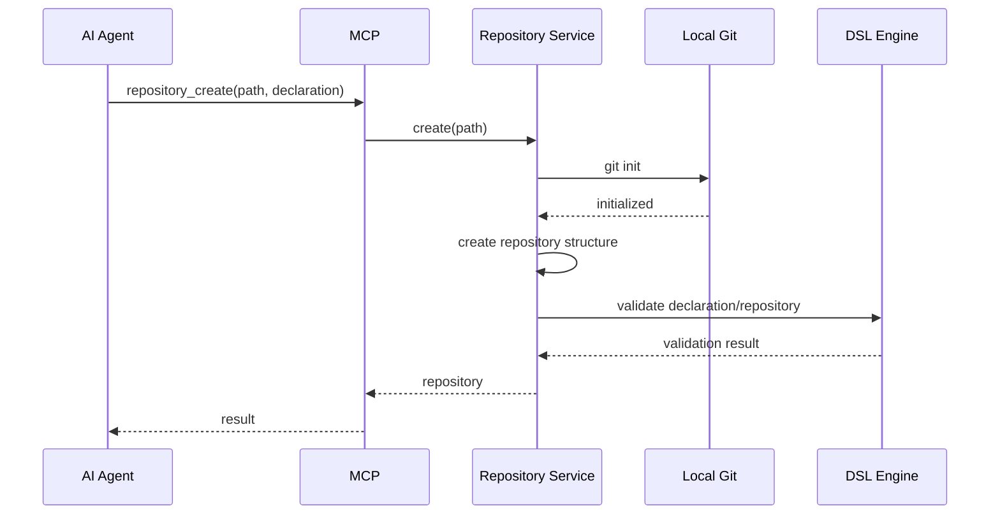
```mermaid
sequenceDiagram
    participant A as AI Agent
    participant M as MCP
    participant R as Repository Service
    participant G as Local Git
    participant D as DSL Engine

    A->>M: repository_create(path, declaration)
    M->>R: create(path)
    R->>G: git init
    G-->>R: initialized
    R->>R: create repository structure
    R->>D: validate declaration/repository
    D-->>R: validation result
    R-->>M: repository
    M-->>A: result
```

---

## 6.2. Открытие существующего repository

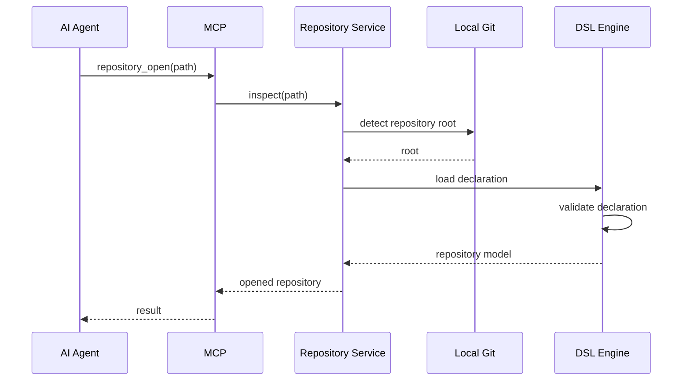
```mermaid
sequenceDiagram
    participant A as AI Agent
    participant M as MCP
    participant R as Repository Service
    participant G as Local Git
    participant D as DSL Engine

    A->>M: repository_open(path)
    M->>R: inspect(path)
    R->>G: detect repository root
    G-->>R: root
    R->>D: load declaration
    D->>D: validate declaration
    D-->>R: repository model
    R-->>M: opened repository
    M-->>A: result
```

---

## 6.3. Клонирование remote repository

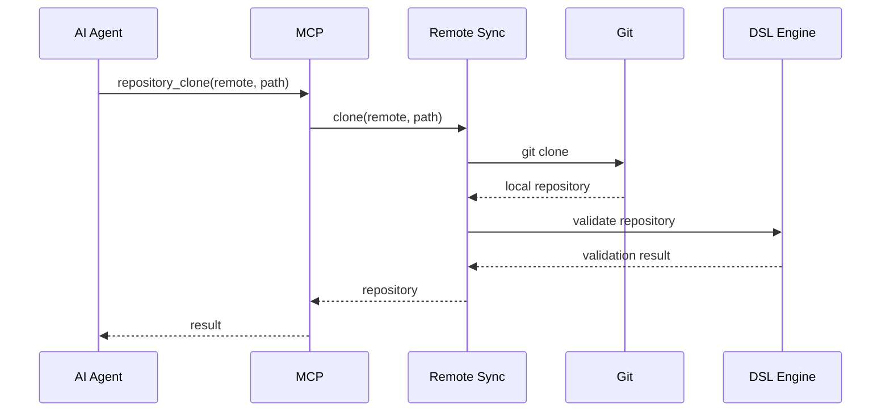
```mermaid
sequenceDiagram
    participant A as AI Agent
    participant M as MCP
    participant S as Remote Sync
    participant G as Git
    participant D as DSL Engine

    A->>M: repository_clone(remote, path)
    M->>S: clone(remote, path)
    S->>G: git clone
    G-->>S: local repository
    S->>D: validate repository
    D-->>S: validation result
    S-->>M: repository
    M-->>A: result
```

---

## 6.4. Валидация repository

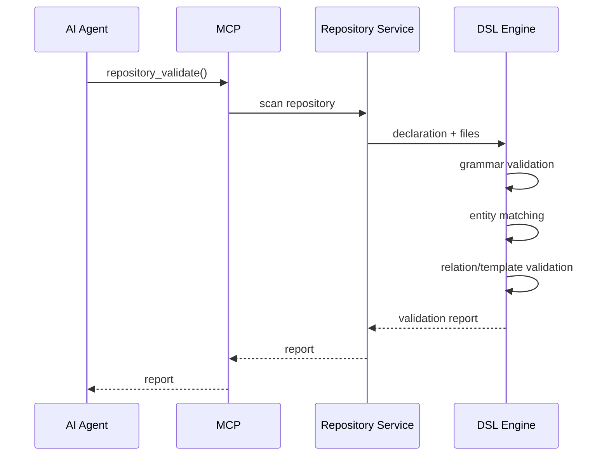
```mermaid
sequenceDiagram
    participant A as AI Agent
    participant M as MCP
    participant R as Repository Service
    participant D as DSL Engine

    A->>M: repository_validate()
    M->>R: scan repository
    R->>D: declaration + files
    D->>D: grammar validation
    D->>D: entity matching
    D->>D: relation/template validation
    D-->>R: validation report
    R-->>M: report
    M-->>A: report
```

---

## 6.5. Получение списка сущностей

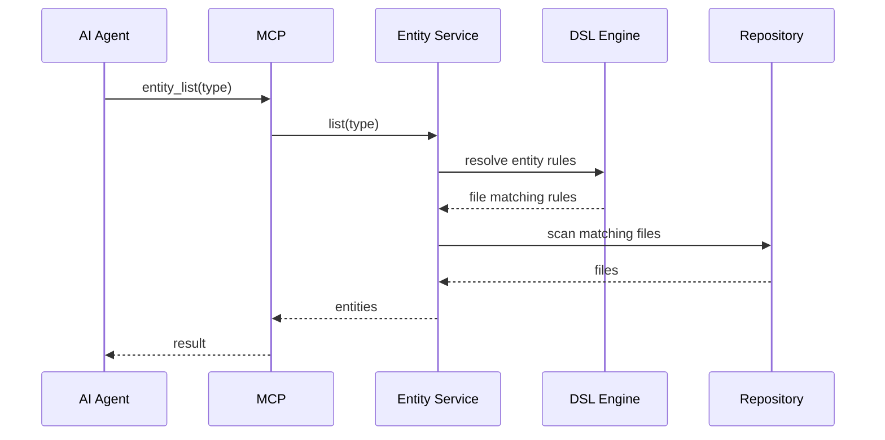
```mermaid
sequenceDiagram
    participant A as AI Agent
    participant M as MCP
    participant E as Entity Service
    participant D as DSL Engine
    participant R as Repository

    A->>M: entity_list(type)
    M->>E: list(type)
    E->>D: resolve entity rules
    D-->>E: file matching rules
    E->>R: scan matching files
    R-->>E: files
    E-->>M: entities
    M-->>A: result
```

---

## 6.6. Чтение сущности

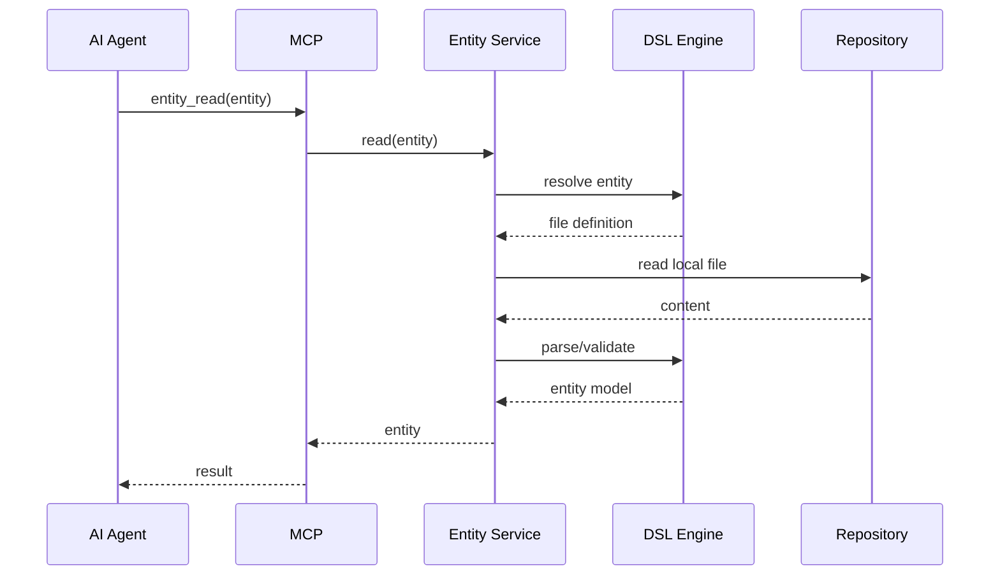
```mermaid
sequenceDiagram
    participant A as AI Agent
    participant M as MCP
    participant E as Entity Service
    participant D as DSL Engine
    participant R as Repository

    A->>M: entity_read(entity)
    M->>E: read(entity)
    E->>D: resolve entity
    D-->>E: file definition
    E->>R: read local file
    R-->>E: content
    E->>D: parse/validate
    D-->>E: entity model
    E-->>M: entity
    M-->>A: result
```

---

## 6.7. Поиск сущностей

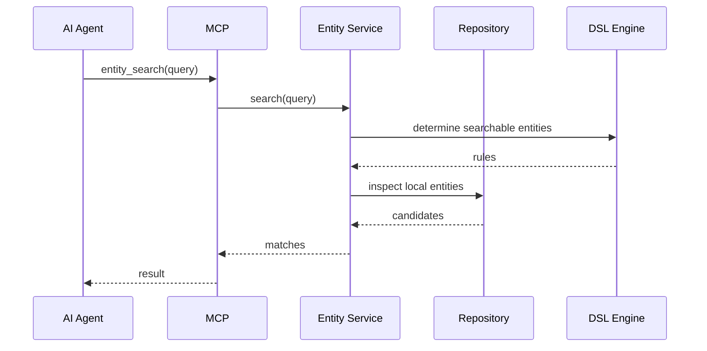
```mermaid
sequenceDiagram
    participant A as AI Agent
    participant M as MCP
    participant E as Entity Service
    participant R as Repository
    participant D as DSL Engine

    A->>M: entity_search(query)
    M->>E: search(query)
    E->>D: determine searchable entities
    D-->>E: rules
    E->>R: inspect local entities
    R-->>E: candidates
    E-->>M: matches
    M-->>A: result
```

---

## 6.8. Создание сущности

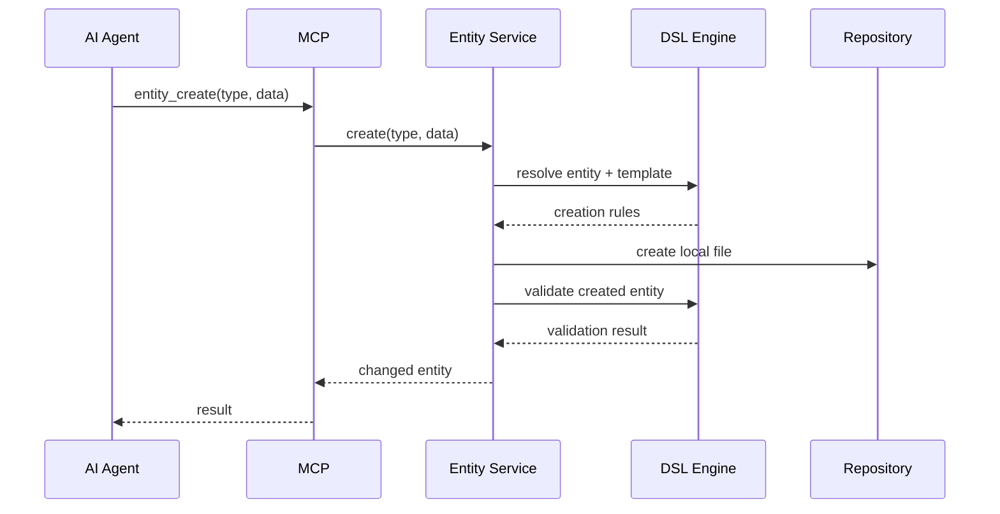
```mermaid
sequenceDiagram
    participant A as AI Agent
    participant M as MCP
    participant E as Entity Service
    participant D as DSL Engine
    participant R as Repository

    A->>M: entity_create(type, data)
    M->>E: create(type, data)
    E->>D: resolve entity + template
    D-->>E: creation rules
    E->>R: create local file
    E->>D: validate created entity
    D-->>E: validation result
    E-->>M: changed entity
    M-->>A: result
```

Git commit и push при этом не выполняются.

---

## 6.9. Изменение сущности

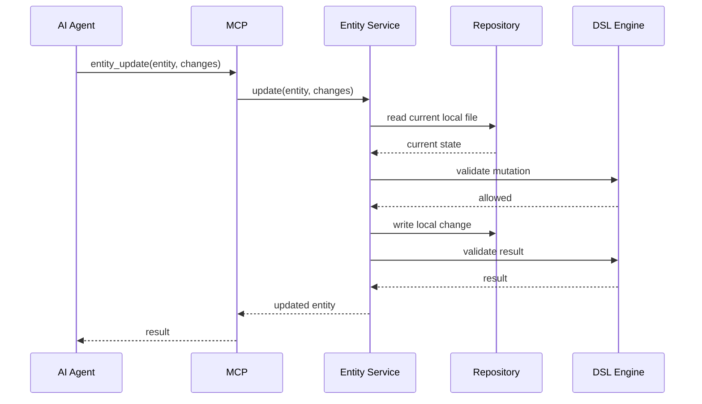
```mermaid
sequenceDiagram
    participant A as AI Agent
    participant M as MCP
    participant E as Entity Service
    participant R as Repository
    participant D as DSL Engine

    A->>M: entity_update(entity, changes)
    M->>E: update(entity, changes)
    E->>R: read current local file
    R-->>E: current state
    E->>D: validate mutation
    D-->>E: allowed
    E->>R: write local change
    E->>D: validate result
    D-->>E: result
    E-->>M: updated entity
    M-->>A: result
```

---

## 6.10. Удаление сущности

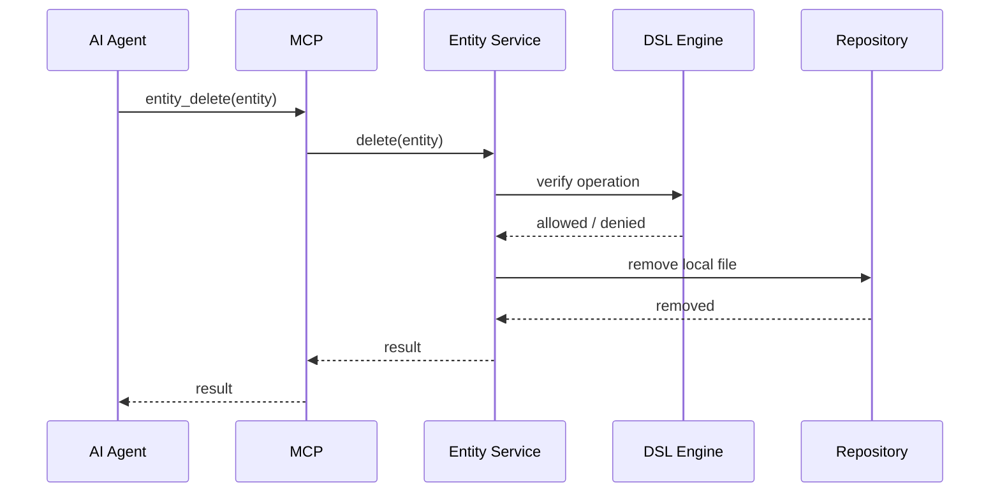
```mermaid
sequenceDiagram
    participant A as AI Agent
    participant M as MCP
    participant E as Entity Service
    participant D as DSL Engine
    participant R as Repository

    A->>M: entity_delete(entity)
    M->>E: delete(entity)
    E->>D: verify operation
    D-->>E: allowed / denied
    E->>R: remove local file
    R-->>E: removed
    E-->>M: result
    M-->>A: result
```

---

## 6.11. Git status

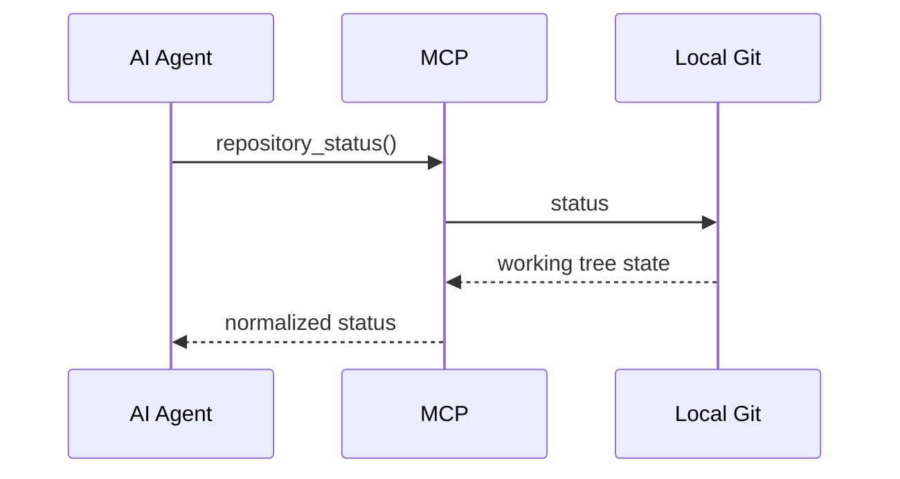
```mermaid
sequenceDiagram
    participant A as AI Agent
    participant M as MCP
    participant G as Local Git

    A->>M: repository_status()
    M->>G: status
    G-->>M: working tree state
    M-->>A: normalized status
```

---

## 6.12. Git diff

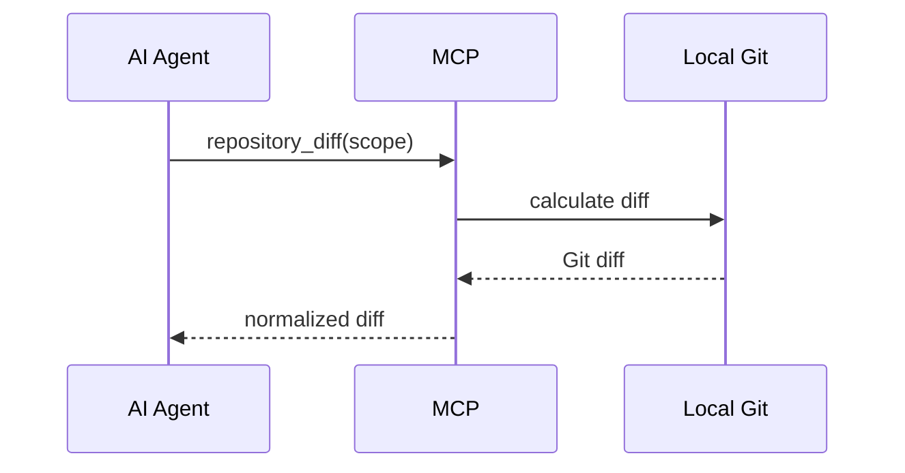
```mermaid
sequenceDiagram
    participant A as AI Agent
    participant M as MCP
    participant G as Local Git

    A->>M: repository_diff(scope)
    M->>G: calculate diff
    G-->>M: Git diff
    M-->>A: normalized diff
```

---

## 6.13. Создание ветки

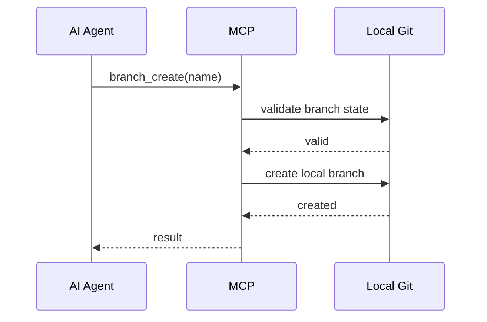
```mermaid
sequenceDiagram
    participant A as AI Agent
    participant M as MCP
    participant G as Local Git

    A->>M: branch_create(name)
    M->>G: validate branch state
    G-->>M: valid
    M->>G: create local branch
    G-->>M: created
    M-->>A: result
```

---

## 6.14. Переключение ветки

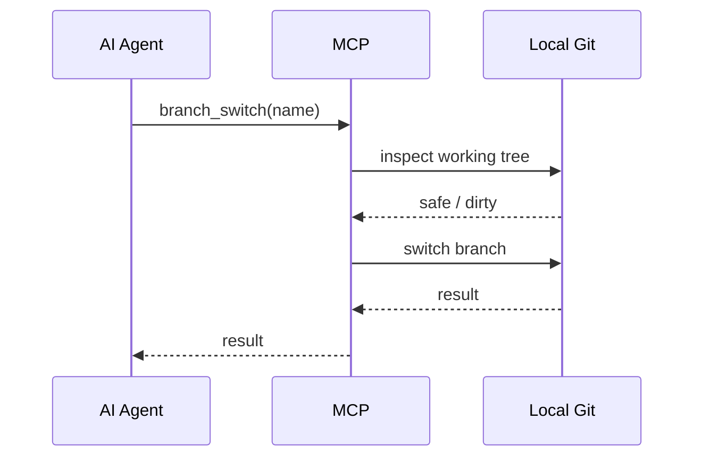
```mermaid
sequenceDiagram
    participant A as AI Agent
    participant M as MCP
    participant G as Local Git

    A->>M: branch_switch(name)
    M->>G: inspect working tree
    G-->>M: safe / dirty
    M->>G: switch branch
    G-->>M: result
    M-->>A: result
```

---

## 6.15. Создание commit

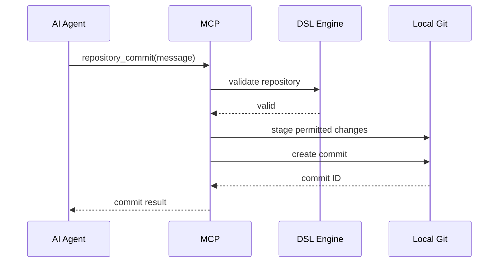
```mermaid
sequenceDiagram
    participant A as AI Agent
    participant M as MCP
    participant D as DSL Engine
    participant G as Local Git

    A->>M: repository_commit(message)
    M->>D: validate repository
    D-->>M: valid
    M->>G: stage permitted changes
    M->>G: create commit
    G-->>M: commit ID
    M-->>A: commit result
```

Push не выполняется.

---

## 6.16. Просмотр истории

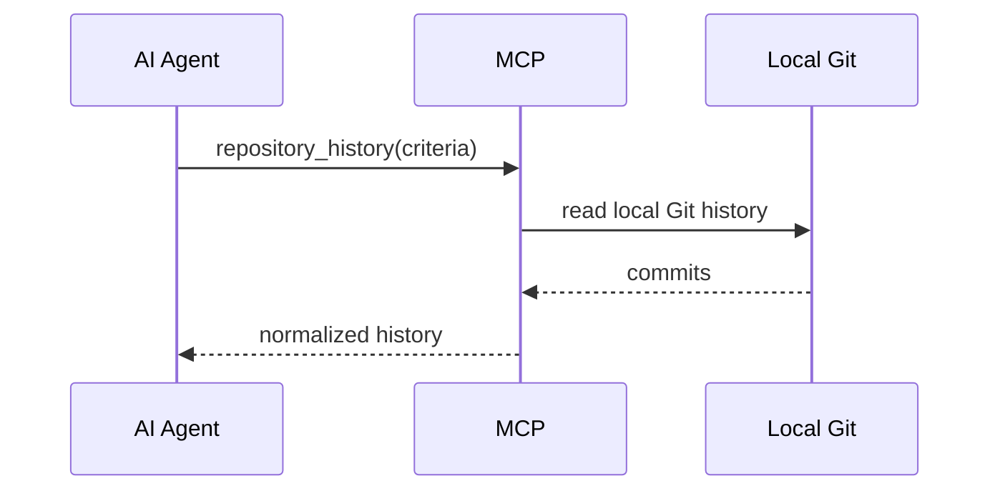
```mermaid
sequenceDiagram
    participant A as AI Agent
    participant M as MCP
    participant G as Local Git

    A->>M: repository_history(criteria)
    M->>G: read local Git history
    G-->>M: commits
    M-->>A: normalized history
```

---

## 6.17. Настройка remote

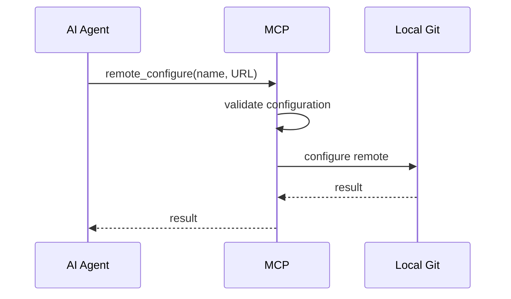
```mermaid
sequenceDiagram
    participant A as AI Agent
    participant M as MCP
    participant G as Local Git

    A->>M: remote_configure(name, URL)
    M->>M: validate configuration
    M->>G: configure remote
    G-->>M: result
    M-->>A: result
```

---

## 6.18. Получение изменений из remote

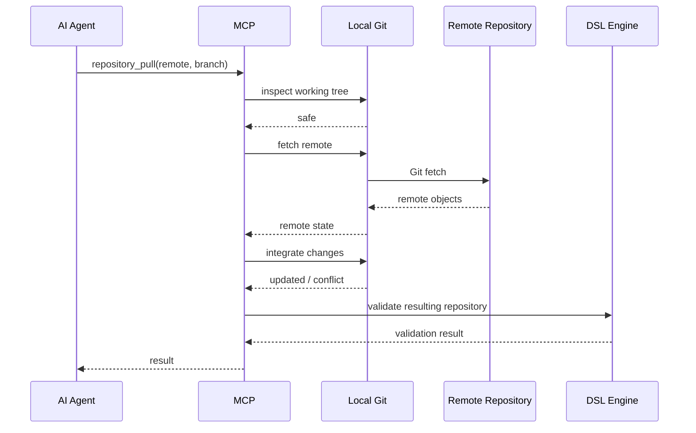
```mermaid
sequenceDiagram
    participant A as AI Agent
    participant M as MCP
    participant G as Local Git
    participant R as Remote Repository
    participant D as DSL Engine

    A->>M: repository_pull(remote, branch)
    M->>G: inspect working tree
    G-->>M: safe
    M->>G: fetch remote
    G->>R: Git fetch
    R-->>G: remote objects
    G-->>M: remote state
    M->>G: integrate changes
    G-->>M: updated / conflict
    M->>D: validate resulting repository
    D-->>M: validation result
    M-->>A: result
```

При конфликте автоматическое разрешение не выполняется.

---

## 6.19. Публикация repository

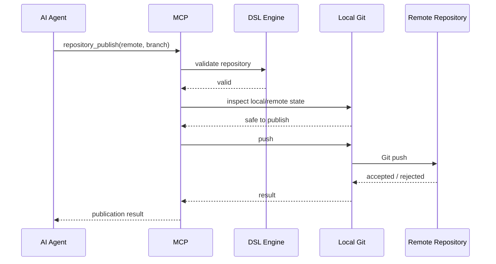
```mermaid
sequenceDiagram
    participant A as AI Agent
    participant M as MCP
    participant D as DSL Engine
    participant G as Local Git
    participant R as Remote Repository

    A->>M: repository_publish(remote, branch)
    M->>D: validate repository
    D-->>M: valid
    M->>G: inspect local/remote state
    G-->>M: safe to publish
    M->>G: push
    G->>R: Git push
    R-->>G: accepted / rejected
    G-->>M: result
    M-->>A: publication result
```

---

# 7. Принципы работы с DSL

## 7.1. DSL является нормативным описанием repository

MCP не должен угадывать структуру архитектурного repository.

DSL определяет:

* какие типы сущностей существуют;
* где расположены их файлы;
* какие имена файлов им соответствуют;
* какой формат используется;
* какой template используется;
* какие отношения существуют между типами сущностей.

---

## 7.2. DSL и данные разделены

```text
DSL
 ↓
определяет правила

Repository files
 ↓
содержат экземпляры сущностей
```

Например:

```text
entity: fact
```

определяется DSL.

Конкретный:

```text
F-0001.md
```

является экземпляром сущности.

---

## 7.3. Entity names не являются глобальными presets

Имена:

```text
fact
requirement
category
architecture_artifact
```

являются identifiers конкретного repository.

Добавление нового типа сущности не должно требовать изменения MCP Core.

---

## 7.4. Закрытая грамматика

Структурные элементы DSL должны образовывать закрытую грамматику.

Неизвестный structural key является ошибкой.

---

## 7.5. Presets являются закрытыми

Значения полей, определённых как presets, должны принадлежать зарегистрированному перечню.

Новые произвольные значения в preset-поле не допускаются.

---

## 7.6. Явные пользовательские значения

Произвольные значения разрешаются только там, где это прямо предусмотрено DSL.

Например:

* entity identifier;
* entity relation;
* repository-relative path;
* filename rule;
* template path.

---

## 7.7. Нет implicit logic

DSL не должен использовать:

* вычисляемые переменные;
* скрытые defaults;
* inferred entities;
* автоматически создаваемые relations;
* неявные преобразования типов;
* скрытые write targets.

---

## 7.8. Repository-defined relations

Relations связывают объявленные типы сущностей.

Например:

```yaml
entities:

  - name: fact
    relations:
      - requirement
      - category
```

`requirement` и `category` должны существовать среди объявленных entity.

DSL описывает допустимость смысловой связи между типами сущностей, но не обязан описывать конкретную связь экземпляров:

```text
F-0001 → R-0007
```

Такая информация относится к данным repository.

---

## 7.9. Файловая модель определяется декларацией

DSL должен позволять определить:

```text
path
filename
format
template
```

для каждого entity.

MCP не должен содержать hardcoded:

```text
facts/
requirements/
categories/
```

---

## 7.10. Template является стартовым содержимым

Template используется при создании нового экземпляра сущности.

После создания экземпляр становится самостоятельным repository file.

---

## 7.11. DSL не управляет Git

DSL не должен определять:

```text
remote URL
credentials
Git branch
push policy
authentication
SSH key
provider token
```

Это runtime/repository configuration.

---

## 7.12. DSL validation отделена от Git validation

Необходимо различать:

```text
DSL validation
```

и:

```text
Git repository validation
```

Например:

```text
невалидная декларация
```

является DSL-проблемой.

```text
non-fast-forward
```

является Git-проблемой.

---

## 7.13. Примеры DSL являются исполняемой документацией

Каждый файл в:

```text
examples/declarations/
```

должен:

1. соответствовать текущей версии DSL;
2. проходить автоматический validator;
3. использоваться в regression tests;
4. обновляться при изменении semantic contract DSL.

---

## 7.14. Версионирование DSL

Версия DSL является semantic boundary.

Изменение существующего смысла стабильной версии запрещается.

Новое несовместимое поведение должно оформляться новой версией DSL.

---

# 8. Дорожная карта

## Этап 1. Нормализация контрактов

Цель:

зафиксировать публичную модель будущего MCP.

Необходимо:

* привести contracts к модели local-repository-first;
* удалить требования прямого remote file API;
* определить Repository API;
* определить Entity API;
* определить Local Git API;
* определить Remote Sync API;
* определить error model;
* определить runtime configuration.

Результат:

```text
contracts
+
public function inventory
+
error inventory
```

---

## Этап 2. DSL Engine

Реализовать:

* DSL parser;
* closed grammar validation;
* preset validation;
* entity resolution;
* relations validation;
* path/filename matching;
* template resolution;
* repository validation.

Добавить автоматическую проверку:

```text
examples/declarations/*
```

Результат:

```text
валидатор DSL
+
Repository Model
```

---

## Этап 3. Local Repository Service

Реализовать:

* repository_create;
* repository_open;
* repository validation;
* repository root confinement;
* безопасные filesystem operations.

На этом этапе сеть не требуется.

Результат:

```text
MCP
 ↓
Local Repository
```

---

## Этап 4. Entity Service

Реализовать предусмотренные контрактами:

* entity_list;
* entity_read;
* entity_search;
* entity_create;
* entity_update;
* entity_delete.

Все операции выполняются только локально.

Результат:

```text
AI
 ↓
MCP Entity API
 ↓
DSL
 ↓
Local Files
```

---

## Этап 5. Local Git Service

Реализовать:

* status;
* diff;
* history;
* local branches;
* commit;
* remotes.

Не реализовывать автоматический push.

Результат:

```text
Architecture Repository
+
Local Git history
```

---

## Этап 6. Remote Sync abstraction

Создать provider-independent интерфейс для:

* remote connection;
* fetch;
* clone;
* pull/integration;
* publication/push;
* remote metadata при необходимости.

Результат:

```text
Local Git
 ↓
Remote Sync Interface
```

---

## Этап 7. Forgejo provider

Первым remote provider реализовать Forgejo.

На первом этапе оставить только необходимые общие операции:

* authentication;
* connection;
* repository existence;
* repository metadata;
* repository creation, если требуется;
* remote URL resolution.

Git-содержимое передавать через стандартный Git transport.

Не реализовывать Forgejo file API.

---

## Этап 8. Синхронизация

Реализовать:

```text
repository_clone
repository_pull
repository_publish
```

с обработкой:

* dirty working tree;
* divergence;
* authentication;
* network errors;
* non-fast-forward;
* conflicts.

Запретить:

* implicit merge resolution;
* force push;
* implicit stash/reset.

---

## Этап 9. Полный набор тестов

Реализовать:

### Unit tests

Для:

* DSL;
* Core;
* Repository;
* Entity Service;
* Local Git.

### Contract tests

Проверить:

* наличие всех функций;
* отсутствие лишних публичных функций;
* input/output models;
* errors;
* отсутствие implicit operations.

### Integration tests

Проверить:

```text
Local repository
      ↕
Git
      ↕
Forgejo
```

---

## Этап 10. Semantic Git capabilities

После стабилизации основной модели добавить:

* semantic diff;
* определение изменённых entities;
* сравнение architecture revisions;
* анализ изменений требований;
* историю конкретной сущности.

Например:

```text
Git diff
   ↓
changed files
   ↓
DSL resolution
   ↓
changed entities
```

---

## Этап 11. Расширение provider-модели

После стабилизации Forgejo могут быть добавлены:

* GitLab;
* GitHub;
* Gitea;
* другие Git providers.

Добавление provider не должно изменять DSL или Entity Service.

---

## Этап 12. Расширенный collaboration workflow

Отдельным последующим этапом могут быть добавлены:

* Pull Request / Merge Request;
* review;
* approval;
* CI validation;
* protected branch policies;
* автоматизированные architecture checks.

Эти функции не входят в минимальное ядро MCP и не должны блокировать реализацию локальной модели.

---

# Итоговая целевая модель

```text
                    ┌─────────────────┐
                    │    AI / Goose   │
                    └────────┬────────┘
                             │
                             ▼
                    ┌─────────────────┐
                    │    MCP Server   │
                    └────────┬────────┘
                             │
              ┌──────────────┼───────────────┐
              │              │               │
              ▼              ▼               ▼
          DSL Engine    Entity Service   Git Service
              │              │               │
              └──────────────┼───────────────┘
                             │
                             ▼
                    ┌─────────────────┐
                    │ Local Git Repo  │
                    └────────┬────────┘
                             │
                       explicit sync
                             │
                             ▼
                    ┌─────────────────┐
                    │ Remote Git Repo │
                    └─────────────────┘
```

**Локальный Git-репозиторий является источником текущего рабочего состояния MCP.**

**DSL определяет смысл и организацию его содержимого.**

**Git обеспечивает историю и версионирование.**

**Remote provider обеспечивает внешнее хранение и синхронизацию, но не участвует непосредственно в редактировании архитектурных файлов.**
