# 1. Описание продукта

Необходимо разработать MCP-сервер для управления репозиторием архитектуры, размещённым в GitLab.

Продукт предоставляет ИИ-агенту контролируемый интерфейс для чтения, анализа и изменения архитектурного репозитория без необходимости самостоятельно знать его физическую структуру.

Репозиторий описывается декларацией DSL. Декларация определяет:

* какие логические сущности существуют в репозитории;
* какие сущности могут быть логически связаны между собой;
* где расположены экземпляры каждой сущности;
* по каким правилам определяются файлы экземпляров;
* в каком формате хранятся файлы;
* какой файл используется как шаблон для создания нового экземпляра.

Основной принцип:

```text
DSL
 ↓
описание типов сущностей и их размещения
 ↓
GitLab repository
 ↓
файлы
 ↓
экземпляры сущностей
```

Один файл, удовлетворяющий файловому правилу сущности, представляет один экземпляр этой сущности.

Пример:

```text
fact
 ↓
facts/F-0001.md

requirement
 ↓
requirements/R-0001.md
```

DSL не описывает внутренние поля экземпляров сущности. Содержимое файлов остаётся произвольным в пределах заявленного формата.

Template является стартовым содержимым нового файла, но не является схемой, которой файл обязан соответствовать после создания.

GitLab используется как источник истины, механизм версионирования и механизм согласования изменений.

Все изменения должны выполняться через:

```text
рабочая ветка
    ↓
commit
    ↓
Merge Request
    ↓
целевая ветка
```

Прямое изменение основной ветки продуктом не является штатным сценарием.

---

# 2. Ключевые характеристики

1. **Declarative repository model.** Физическая структура репозитория определяется DSL-декларацией.

2. **Произвольные сущности.** Имена сущностей задаются владельцем репозитория и не ограничиваются заранее определённым набором `fact`, `requirement` и т. п.

3. **File = Entity Instance.** Один подходящий файл соответствует одному экземпляру сущности.

4. **Связи между сущностями.** Каждая сущность может объявлять логические связи с другими объявленными сущностями.

5. **Свободное содержимое.** DSL не описывает поля, структуру текста или бизнес-схему содержимого экземпляра.

6. **Template-based creation.** Каждый тип сущности имеет файл-шаблон того же формата, который используется как основа создания нового экземпляра.

7. **Закрытый DSL.** Все structural keys и preset-значения должны соответствовать таблице DSL.

8. **Git-native workflow.** Изменения выполняются через branch → commit → Merge Request.

9. **Atomic changes.** Несколько файлов одного логического изменения должны по возможности записываться одним Git commit.

10. **Fail closed.** Невалидная декларация, неоднозначная принадлежность файла сущности или нарушение контрактов DSL должны блокировать операции изменения.

---

# 3. Функциональные требования

## 3.1. Обязательная структура проекта

Каноническая таблица DSL должна находиться по пути:

```text
dsl/DSL_V2_TABLES.yaml
```

Этот файл является единственным нормативным источником:

```text
Grammar
Presets
Contracts
```

Все structural keys и preset-значения, используемые реализацией, должны быть представлены в этом файле.

Не допускается наличие скрытых preset-значений, реализованных только в исходном коде.

Человекочитаемое представление при необходимости может автоматически генерироваться в:

```text
docs/dsl/DSL_V2_TABLES.md
```

Но нормативным остаётся:

```text
dsl/DSL_V2_TABLES.yaml
```

Примеры корректных деклараций должны находиться в:

```text
examples/declarations/
```

Минимальный набор:

```text
examples/declarations/
├── minimal.yaml
├── standard.yaml
├── regex-paths.yaml
└── relations.yaml
```

Примеры template-файлов рекомендуется хранить в:

```text
examples/templates/
```

Основной файл декларации управляемого архитектурного репозитория по умолчанию:

```text
governance/declaration.yaml
```

Путь должен быть конфигурируемым.

---

## 3.2. Конфигурация подключения

MCP должен получать из конфигурации:

```text
GitLab URL
Project ID или project path
Access token
Target/default branch
Declaration path
Timeout
TLS verification
```

Секреты запрещено помещать в DSL.

Token должен передаваться через environment/configuration secret mechanism.

---

## 3.3. Загрузка DSL

При обращении к репозиторию MCP должен:

```text
получить declaration
        ↓
определить declaration.version
        ↓
загрузить соответствующую DSL specification
        ↓
проверить Grammar
        ↓
проверить Presets
        ↓
проверить Contracts
        ↓
построить Runtime Repository Model
```

Если DSL невалиден, разрешаются диагностические операции, но операции изменения архитектурных данных должны блокироваться.

---

## 3.4. Runtime-модель сущностей

Для каждой сущности необходимо построить объект примерно следующей логики:

```text
EntityDefinition
    name
    relations[]
    files
        path
            match
            value
        filename
            match
            value
        format
        template
```

`name` — пользовательское уникальное имя.

Примеры:

```text
fact
requirement
network_fact
information_security_requirement
logical_component
physical_server
```

Имя сущности не является preset.

---

## 3.5. Связи сущностей

Поле:

```yaml
relations:
  - requirement
  - category
```

содержит ссылки на `name` других сущностей той же декларации.

Каждая ссылка должна разрешаться ровно в одну сущность.

Не допускаются:

```text
ссылка на отсутствующую entity
дубликаты relation
ссылка на неоднозначное имя
```

Связь является отношением **между классами сущностей**, а не утверждением о конкретных экземплярах.

Например:

```text
fact ↔ requirement
```

означает, что экземпляры `fact` могут содержательно связываться с экземплярами `requirement`.

DSL не определяет, где именно внутри произвольного файла записана ссылка на конкретный экземпляр.

Интерпретация конкретных связей внутри файлов выполняется ИИ-агентом на основании содержимого соответствующих файлов.

---

## 3.6. Обнаружение экземпляров

MCP должен предоставлять операцию:

```text
entity_list(entity_name, ref)
```

Алгоритм:

```text
EntityDefinition
      ↓
repository tree
      ↓
path matcher
      ↓
filename matcher
      ↓
список EntityInstance
```

Для каждого экземпляра как минимум возвращаются:

```text
entity_name
repository_path
filename
ref
blob/commit metadata при наличии
```

Получение дерева репозитория должно использовать GitLab Repository API и поддерживать pagination.

---

## 3.7. Чтение экземпляра

Операция:

```text
entity_read(
    entity_name,
    repository_path,
    ref
)
```

должна:

1. найти определение сущности;
2. проверить соответствие `repository_path` правилам сущности;
3. получить файл из GitLab;
4. проверить заявленный `format`;
5. вернуть содержимое без изменения.

GitLab Repository Files API позволяет получать файл по пути и конкретному `ref`; реализация должна всегда явно фиксировать ref/branch/SHA, а не полагаться на неявное состояние репозитория.

---

## 3.8. Получение связанных типов сущностей

Операция:

```text
entity_relations(entity_name)
```

возвращает список связанных типов сущностей.

Например:

```text
entity_relations("fact")
→
requirement
category
architecture_artifact
```

Обратный поиск тоже должен работать.

Если:

```yaml
fact:
  relations:
    - requirement
```

то запрос связей `requirement` также должен позволять определить `fact`.

Дублировать обратную связь в декларации не требуется.

---

## 3.9. Получение template

Операция:

```text
entity_template(entity_name, ref)
```

должна:

1. получить `files.template`;
2. проверить безопасность пути;
3. прочитать template из GitLab;
4. проверить соответствие `files.format`;
5. вернуть template ИИ-агенту.

Template является обычным файлом.

В template запрещено вводить специальную обязательную DSL-грамматику вроде:

```text
{{field:id}}
{{variable}}
{{expression}}
```

если такой синтаксис не является просто содержимым конкретного пользовательского формата.

MCP не должен интерпретировать template как исполняемый шаблон.

---

## 3.10. Создание экземпляра

Создание должно выполняться в два логических этапа:

```text
entity_template()
        ↓
ИИ формирует итоговое содержимое
на основе template
        ↓
entity_create()
```

Операция:

```text
entity_create(
    entity_name,
    target_path,
    content,
    branch,
    commit_message
)
```

обязана проверить:

```text
entity существует
target path безопасен
target path соответствует files.path
filename соответствует files.filename
файл ещё не существует
content соответствует files.format
рабочая branch допустима
```

После этого выполняется `create` action GitLab Commit API.

---

## 3.11. Изменение экземпляра

Операция:

```text
entity_update(
    entity_name,
    repository_path,
    content,
    branch,
    expected_commit,
    commit_message
)
```

должна:

```text
прочитать актуальный файл
        ↓
проверить expected revision
        ↓
проверить принадлежность entity
        ↓
проверить format нового содержимого
        ↓
commit update
```

При обнаружении изменения файла после его чтения операция должна завершаться конфликтом, а не перезаписывать новые данные.

---

## 3.12. Удаление экземпляра

Операция:

```text
entity_delete(...)
```

должна:

```text
проверить существование файла
        ↓
проверить принадлежность entity
        ↓
проверить revision
        ↓
commit delete
```

Семантическую необходимость удаления определяет ИИ/пользователь, а не DSL.

---

## 3.13. Перемещение экземпляра

Операция:

```text
entity_move(
    entity_name,
    source_path,
    target_path,
    ...
)
```

разрешается только если:

```text
source принадлежит entity
AND
target также соответствует той же entity
```

Перемещение файла так, чтобы он начал соответствовать другой сущности, не должно неявно менять его тип.

Такое действие должно выполняться как отдельное осознанное преобразование.

GitLab Commit API поддерживает атомарные действия `create`, `update`, `delete` и `move`, в том числе несколько действий в одном commit.

---

## 3.14. Batch-изменения

Необходимо поддержать:

```text
repository_commit(actions[])
```

где actions могут содержать:

```text
create
update
delete
move
```

Все действия сначала валидируются.

Только после успешной валидации всего набора выполняется один GitLab commit.

Если хотя бы одно действие невалидно:

```text
commit не создаётся
```

Это необходимо для архитектурных изменений, затрагивающих сразу несколько сущностей.

---

## 3.15. Ветки

Необходимо поддержать:

```text
branch_list
branch_create
branch_delete
```

Рабочая ветка создаётся от явно заданного:

```text
branch
или
commit SHA
```

Удаление default/protected branch запрещается и дополнительно контролируется самим GitLab. GitLab Branches API предоставляет операции получения, создания и удаления веток.

---

## 3.16. История и diff

Необходимо поддержать:

```text
commit_list
commit_get
commit_diff
compare_refs
```

Это необходимо ИИ-агенту для понимания:

```text
кто изменил файл
что было изменено
какие изменения содержит рабочая ветка
чем она отличается от target branch
```

## GitLab предоставляет получение истории commits, diff конкретного commit и сравнение двух refs.

## 3.17. Merge Request

Необходимо поддержать:

```text
merge_request_create
merge_request_get
merge_request_diff
merge_request_merge
```

Merge Request является штатным способом доставки архитектурных изменений в target branch.

Перед merge необходимо повторно проверить:

```text
MR открыт
source branch соответствует ожидаемой
target branch соответствует ожидаемой
отсутствует конфликт
head SHA не изменился неожиданно
DSL новой версии репозитория валиден
```

GitLab API предоставляет управление Merge Requests, получение их diff и merge.
Автоматический merge без явного запроса пользователя не выполнять.

---

# 4. Нефункциональные требования

## 4.1. Безопасность

### Authentication

GitLab token:

```text
не хранить в repository
не хранить в DSL
не выводить в logs
не возвращать через MCP tools
```

Использовать минимально необходимые права.

Для чтения предпочтительны read-only scopes, если выбранная операция это допускает. Для операций записи использовать scope, необходимый GitLab API. Repository Files API различает read-only scopes и `api` для read/write операций.

### TLS

TLS verification включена по умолчанию.

Отключение TLS verification возможно только явной конфигурацией и должно сопровождаться warning.

### Path traversal

Любой repository path нормализуется до выполнения запроса.

Запрещаются:

```text
absolute path
..
backslash escape
URL/path traversal
symlink escape при локальной работе
```

### Protected branches

Нельзя обходить механизмы защиты GitLab.

Прямое изменение default branch MCP не выполняет в штатном режиме.

### Secrets

Содержимое token, Authorization headers и иных credentials не должно попадать:

```text
в exception
в debug logs
в telemetry
в commit
в MCP response
```

### Conflict protection

Update/delete/move должны использовать optimistic concurrency.

Перед изменением проверяется известный агенту commit/SHA.

При расхождении:

```text
CONFLICT
```

а не last-write-wins.

### Fail closed

Если:

```text
DSL invalid
entity ambiguous
file matches >1 entities
unknown preset
broken relation
unsafe path
unknown DSL version
```

операции записи блокируются.

---

## 4.2. Производительность

Не скачивать весь repository при каждом запросе.

Использовать GitLab Repository Tree API и выборочное чтение файлов.

Кэшировать:

```text
parsed DSL
EntityDefinition
compiled regex
repository tree
template content
```

Ключ кэша должен включать:

```text
project
ref/commit SHA
```

Изменение SHA автоматически инвалидирует связанный кэш.

Сканирование файлов должно иметь сложность порядка:

```text
O(number_of_repository_paths × number_of_entities)
```

с предварительно скомпилированными regex.

При большом количестве сущностей допускается построение индекса path rules.

Batch mutation должна выполняться одним commit вместо последовательности отдельных commits.

Pagination GitLab должна обрабатываться прозрачно.

Retry допускается автоматически для безопасных GET-запросов и сетевых ошибок.

Mutation-запрос нельзя слепо повторять без проверки результата предыдущего запроса.

Timeout должен быть конфигурируемым.

Рекомендуемое значение по умолчанию:

```text
30 seconds
```

---

# 5. Диаграммы последовательности операций GitLab

Операционный контур v1 намеренно ограничен GitLab-функциями, необходимыми для архитектурного репозитория.

Не реализовывать в v1 управление:

```text
users
groups
runners
CI variables
issues
releases
packages
deployments
GitLab administration
```

## 5.1. Получение дерева репозитория

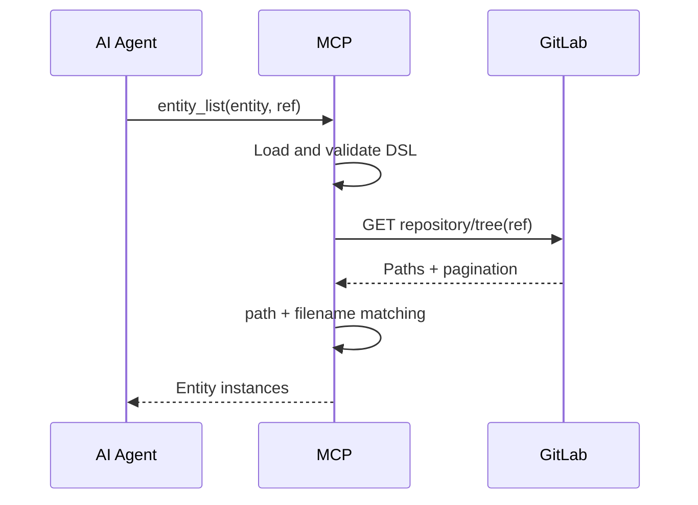
```mermaid
sequenceDiagram
    participant A as AI Agent
    participant M as MCP
    participant G as GitLab

    A->>M: entity_list(entity, ref)
    M->>M: Load and validate DSL
    M->>G: GET repository/tree(ref)
    G-->>M: Paths + pagination
    M->>M: path + filename matching
    M-->>A: Entity instances
```

## 5.2. Чтение файла

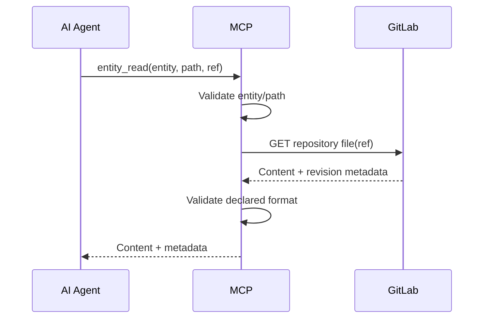
```mermaid
sequenceDiagram
    participant A as AI Agent
    participant M as MCP
    participant G as GitLab

    A->>M: entity_read(entity, path, ref)
    M->>M: Validate entity/path
    M->>G: GET repository file(ref)
    G-->>M: Content + revision metadata
    M->>M: Validate declared format
    M-->>A: Content + metadata
```

## 5.3. Получение истории и diff

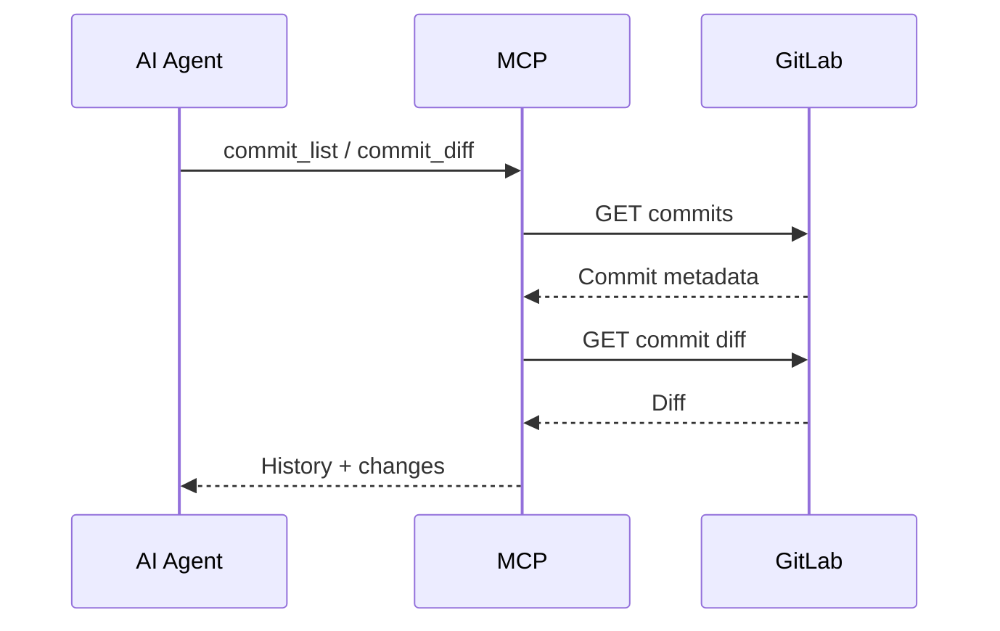
```mermaid
sequenceDiagram
    participant A as AI Agent
    participant M as MCP
    participant G as GitLab

    A->>M: commit_list / commit_diff
    M->>G: GET commits
    G-->>M: Commit metadata
    M->>G: GET commit diff
    G-->>M: Diff
    M-->>A: History + changes
```

## 5.4. Получение списка веток

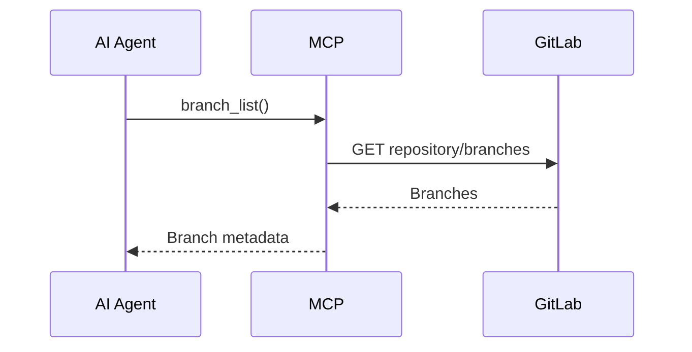
```mermaid
sequenceDiagram
    participant A as AI Agent
    participant M as MCP
    participant G as GitLab

    A->>M: branch_list()
    M->>G: GET repository/branches
    G-->>M: Branches
    M-->>A: Branch metadata
```

## 5.5. Создание рабочей ветки

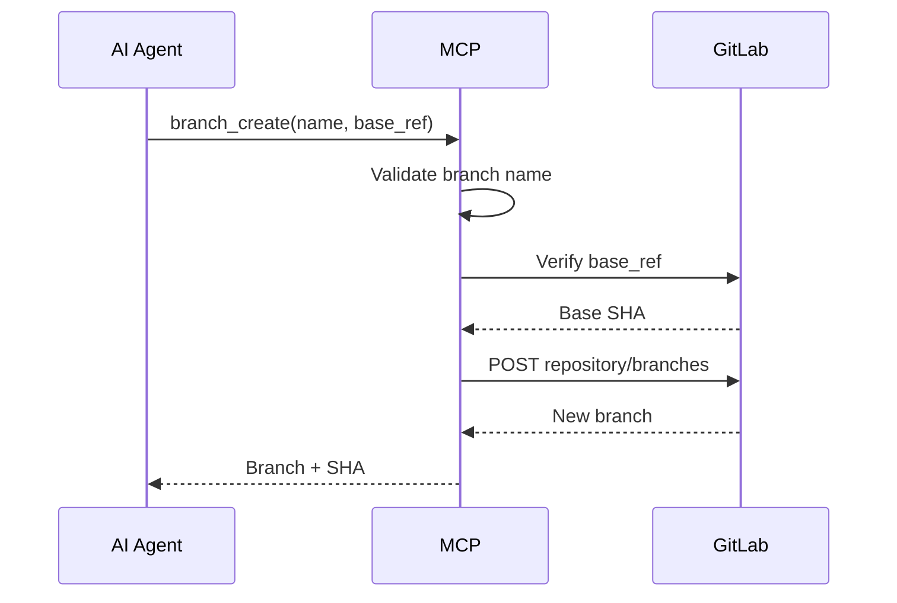
```mermaid
sequenceDiagram
    participant A as AI Agent
    participant M as MCP
    participant G as GitLab

    A->>M: branch_create(name, base_ref)
    M->>M: Validate branch name
    M->>G: Verify base_ref
    G-->>M: Base SHA
    M->>G: POST repository/branches
    G-->>M: New branch
    M-->>A: Branch + SHA
```

## 5.6. Создание файла

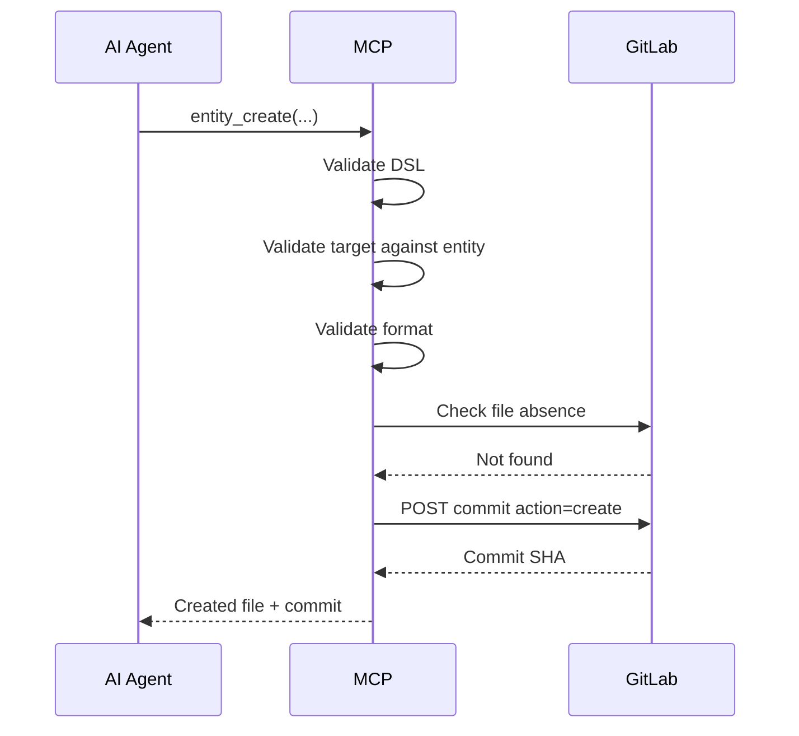
```mermaid
sequenceDiagram
    participant A as AI Agent
    participant M as MCP
    participant G as GitLab

    A->>M: entity_create(...)
    M->>M: Validate DSL
    M->>M: Validate target against entity
    M->>M: Validate format
    M->>G: Check file absence
    G-->>M: Not found
    M->>G: POST commit action=create
    G-->>M: Commit SHA
    M-->>A: Created file + commit
```

## 5.7. Изменение файла

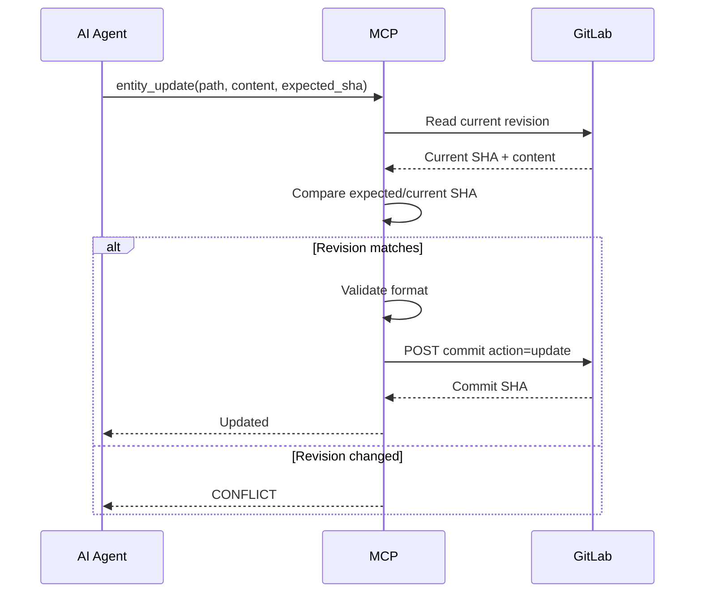
```mermaid
sequenceDiagram
    participant A as AI Agent
    participant M as MCP
    participant G as GitLab

    A->>M: entity_update(path, content, expected_sha)
    M->>G: Read current revision
    G-->>M: Current SHA + content
    M->>M: Compare expected/current SHA

    alt Revision matches
        M->>M: Validate format
        M->>G: POST commit action=update
        G-->>M: Commit SHA
        M-->>A: Updated
    else Revision changed
        M-->>A: CONFLICT
    end
```

## 5.8. Удаление файла

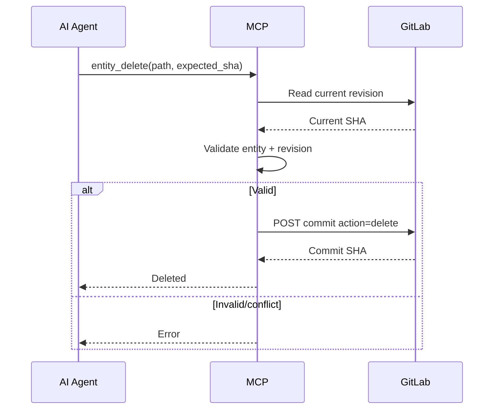
```mermaid
sequenceDiagram
    participant A as AI Agent
    participant M as MCP
    participant G as GitLab

    A->>M: entity_delete(path, expected_sha)
    M->>G: Read current revision
    G-->>M: Current SHA
    M->>M: Validate entity + revision

    alt Valid
        M->>G: POST commit action=delete
        G-->>M: Commit SHA
        M-->>A: Deleted
    else Invalid/conflict
        M-->>A: Error
    end
```

## 5.9. Перемещение файла

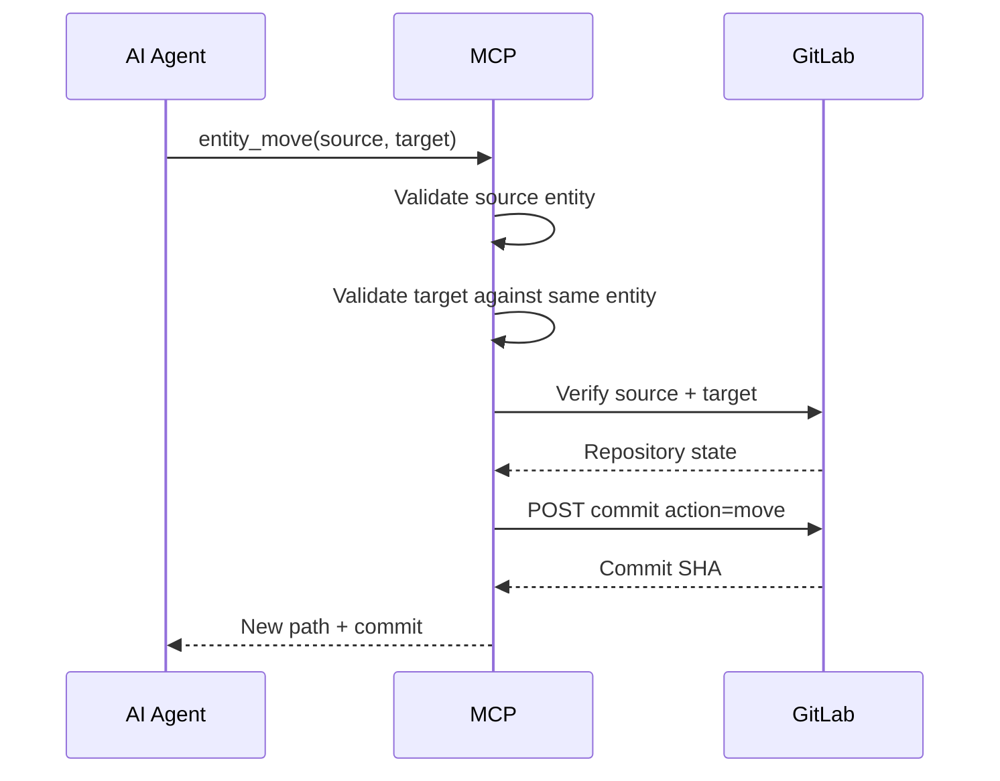
```mermaid
sequenceDiagram
    participant A as AI Agent
    participant M as MCP
    participant G as GitLab

    A->>M: entity_move(source, target)
    M->>M: Validate source entity
    M->>M: Validate target against same entity
    M->>G: Verify source + target
    G-->>M: Repository state
    M->>G: POST commit action=move
    G-->>M: Commit SHA
    M-->>A: New path + commit
```

## 5.10. Атомарное изменение нескольких файлов

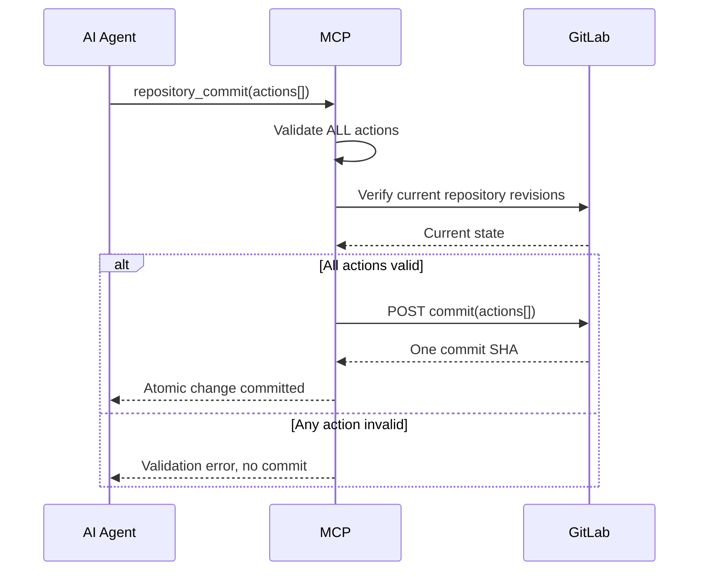
```mermaid
sequenceDiagram
    participant A as AI Agent
    participant M as MCP
    participant G as GitLab

    A->>M: repository_commit(actions[])
    M->>M: Validate ALL actions
    M->>G: Verify current repository revisions
    G-->>M: Current state

    alt All actions valid
        M->>G: POST commit(actions[])
        G-->>M: One commit SHA
        M-->>A: Atomic change committed
    else Any action invalid
        M-->>A: Validation error, no commit
    end
```

## 5.11. Сравнение рабочей и целевой ветки

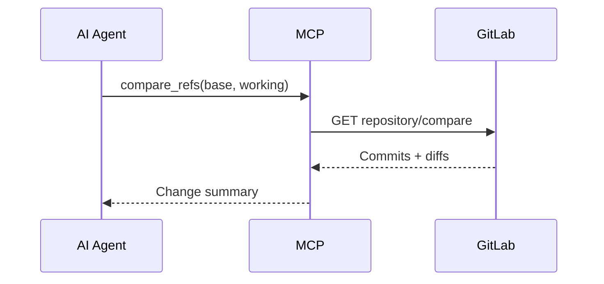
```mermaid
sequenceDiagram
    participant A as AI Agent
    participant M as MCP
    participant G as GitLab

    A->>M: compare_refs(base, working)
    M->>G: GET repository/compare
    G-->>M: Commits + diffs
    M-->>A: Change summary
```

## 5.12. Создание Merge Request

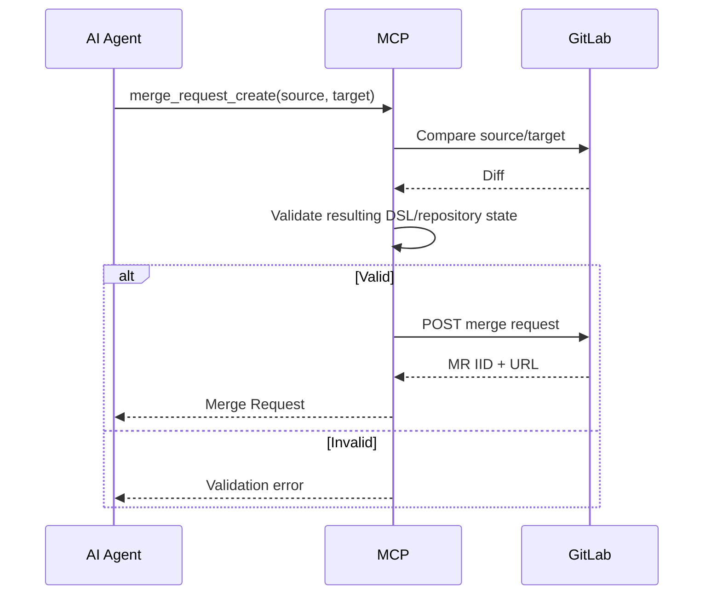
```mermaid
sequenceDiagram
    participant A as AI Agent
    participant M as MCP
    participant G as GitLab

    A->>M: merge_request_create(source, target)
    M->>G: Compare source/target
    G-->>M: Diff
    M->>M: Validate resulting DSL/repository state

    alt Valid
        M->>G: POST merge request
        G-->>M: MR IID + URL
        M-->>A: Merge Request
    else Invalid
        M-->>A: Validation error
    end
```

## 5.13. Получение состояния Merge Request

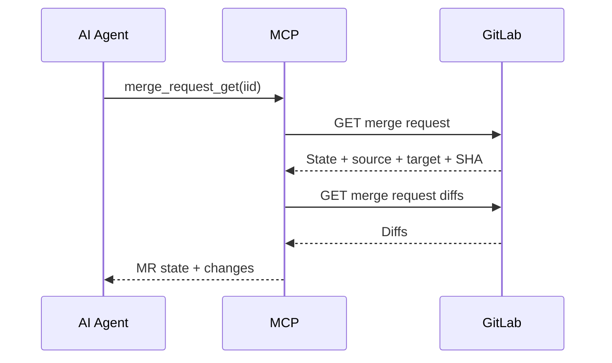
```mermaid
sequenceDiagram
    participant A as AI Agent
    participant M as MCP
    participant G as GitLab

    A->>M: merge_request_get(iid)
    M->>G: GET merge request
    G-->>M: State + source + target + SHA
    M->>G: GET merge request diffs
    G-->>M: Diffs
    M-->>A: MR state + changes
```

## 5.14. Merge

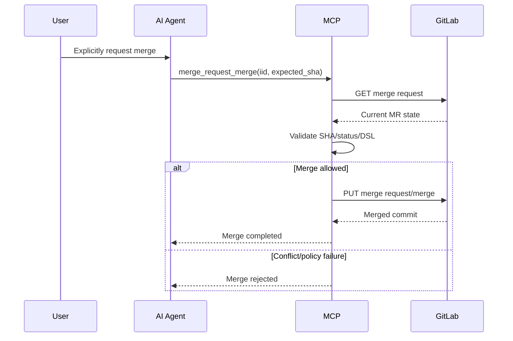
```mermaid
sequenceDiagram
    participant U as User
    participant A as AI Agent
    participant M as MCP
    participant G as GitLab

    U->>A: Explicitly request merge
    A->>M: merge_request_merge(iid, expected_sha)
    M->>G: GET merge request
    G-->>M: Current MR state
    M->>M: Validate SHA/status/DSL

    alt Merge allowed
        M->>G: PUT merge request/merge
        G-->>M: Merged commit
        M-->>A: Merge completed
    else Conflict/policy failure
        M-->>A: Merge rejected
    end
```

Перед merge необходимо использовать ожидаемый SHA головы MR для защиты от ситуации, когда после анализа в ветку были добавлены новые изменения. Актуальный GitLab Merge Requests API поддерживает merge и проверку состояния MR.

## 5.15. Удаление рабочей ветки

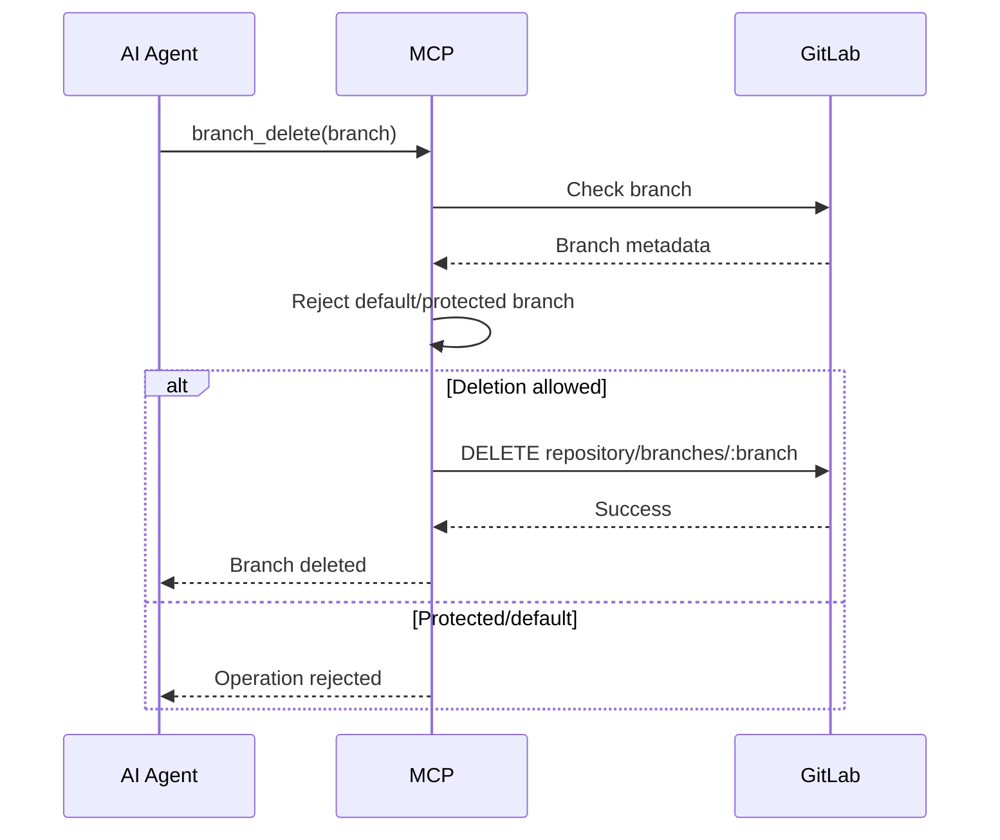
```mermaid
sequenceDiagram
    participant A as AI Agent
    participant M as MCP
    participant G as GitLab

    A->>M: branch_delete(branch)
    M->>G: Check branch
    G-->>M: Branch metadata
    M->>M: Reject default/protected branch

    alt Deletion allowed
        M->>G: DELETE repository/branches/:branch
        G-->>M: Success
        M-->>A: Branch deleted
    else Protected/default
        M-->>A: Operation rejected
    end
```

---

# 6. Логика и принципы работы с DSL

## 6.1. DSL — декларация репозитория, а не схема содержимого

DSL отвечает:

```text
что существует
где находится
как определить файл
какого он формата
из какого template создаётся
с какими классами сущностей он связан
```

DSL не отвечает:

```text
какие поля есть внутри Markdown
какие headings обязательны
какой YAML key является ID
как устроена бизнес-семантика документа
```

---

## 6.2. Закрытая Grammar

Корень:

```yaml
declaration:
  kind: architecture_repository
  version: v2

entities:
  ...
```

Неизвестный structural key является ошибкой.

---

## 6.3. Presets

Значения таких полей, как:

```text
declaration.kind
declaration.version
match
format
```

могут использовать только значения из:

```text
dsl/DSL_V2_TABLES.yaml
```

Нельзя добавлять новый preset непосредственно в код.

Сначала изменяется таблица DSL и версия DSL, если изменение нарушает семантическую совместимость.

---

## 6.4. Произвольные значения

Произвольными являются только данные конкретного репозитория:

```text
entity.name
files.path.value
files.filename.value
files.template
```

Значения `relations[]` формально пользовательские, но должны ссылаться на существующий `entity.name`.

---

## 6.5. Имена сущностей

Допустимо:

```yaml
name: fact
```

и:

```yaml
name: network_security_requirement
```

Для создания нового имени сущности не требуется изменение Preset Registry.

Имя должно быть:

```text
непустым
уникальным
стабильным в рамках декларации
```

---

## 6.6. Relations

Например:

```yaml
- name: fact
  relations:
    - requirement
    - category
```

означает:

```text
fact ↔ requirement
fact ↔ category
```

Обратное объявление необязательно.

Relation не создаёт автоматически связи экземпляров:

```text
F-0001 ↛ автоматически R-0001
```

Конкретная связь должна определяться содержимым файлов и анализом агента.

---

## 6.7. File matching

Каждая сущность содержит:

```yaml
files:
  path:
    match: ...
    value: ...

  filename:
    match: ...
    value: ...

  format: ...

  template: ...
```

Принадлежность файла определяется:

```text
path matches
AND
filename matches
```

`match=exact` означает полное совпадение.

`match=regex` означает полное совпадение regex, а не поиск substring.

Regex должен компилироваться один раз при загрузке DSL.

---

## 6.8. Неоднозначность запрещена

Если файл соответствует двум сущностям:

```text
Entity A ─┐
          ├─ file.md
Entity B ─┘
```

DSL/repository state считается невалидным.

MCP не должен выбирать сущность самостоятельно.

---

## 6.9. Format

`format` определяет только способ синтаксической проверки.

Например:

```text
yaml
json
markdown
markdown_front_matter
text
```

Для YAML/JSON проверяется синтаксическая корректность.

Для `markdown_front_matter` проверяется корректность front matter и текстовой части согласно определению DSL.

Смысл содержимого MCP Core не валидирует.

---

## 6.10. Template

Template:

```text
обычный файл
того же format
находится внутри repository
используется при создании
```

Template не является schema.

После создания:

```text
template
   ↓
new entity instance
   ↓
дальнейшее свободное редактирование
```

Target не обязан сохранять исходную структуру template.

---

## 6.11. Runtime Index

После загрузки repository рекомендуется построить:

```text
RepositoryModel

entities_by_name
relations_graph
compiled_path_matchers
compiled_filename_matchers
instances_by_entity
entity_by_repository_path
```

Это позволит не перечитывать DSL при каждой операции.

---

## 6.12. Работа ИИ-агента

ИИ не должен обходить DSL прямыми GitLab-запросами, если для операции существует MCP-инструмент.

Правильный путь:

```text
User intent
   ↓
AI reasoning
   ↓
MCP entity operation
   ↓
DSL validation
   ↓
GitLab operation
```

Неправильный путь:

```text
User intent
   ↓
AI самостоятельно придумывает repository path
   ↓
прямое изменение GitLab
```

DSL является обязательным governance layer между агентом и архитектурным репозиторием.

---

# 7. Дорожная карта

[ ] Создать базовую структуру Python-проекта и `.venv`.

[ ] Определить конфигурационную модель GitLab connection.

[ ] Создать `dsl/DSL_V2_TABLES.yaml`.

[ ] Зафиксировать в таблице Grammar, Presets и Contracts DSL v2.

[ ] Добавить `docs/dsl/DSL_V2_TABLES.md`, генерируемый из машиночитаемой таблицы.

[ ] Создать `examples/declarations/` и минимальный набор валидных примеров.

[ ] Создать набор intentionally-invalid деклараций для negative testing.

[ ] Реализовать parser DSL.

[ ] Реализовать closed-grammar validation.

[ ] Реализовать preset validation.

[ ] Реализовать validation произвольных `entity.name`.

[ ] Реализовать проверку уникальности сущностей.

[ ] Реализовать resolution `relations[] → entity.name`.

[ ] Реализовать симметричный runtime relations graph.

[ ] Реализовать path matcher `exact`.

[ ] Реализовать path matcher `regex`.

[ ] Реализовать filename matcher `exact`.

[ ] Реализовать filename matcher `regex`.

[ ] Реализовать overlap detection между сущностями.

[ ] Реализовать GitLab API client.

[ ] Реализовать безопасную работу с credentials и TLS.

[ ] Реализовать Repository Tree pagination.

[ ] Реализовать получение файлов и metadata.

[ ] Реализовать Runtime Repository Model.

[ ] Реализовать `entity_list`.

[ ] Реализовать `entity_read`.

[ ] Реализовать `entity_relations`.

[ ] Реализовать `entity_template`.

[ ] Реализовать format validators.

[ ] Реализовать `branch_list`.

[ ] Реализовать `branch_create`.

[ ] Реализовать `branch_delete`.

[ ] Реализовать `entity_create`.

[ ] Реализовать optimistic concurrency для mutation.

[ ] Реализовать `entity_update`.

[ ] Реализовать `entity_delete`.

[ ] Реализовать `entity_move`.

[ ] Реализовать batch `repository_commit`.

[ ] Реализовать `commit_list`.

[ ] Реализовать `commit_get`.

[ ] Реализовать `commit_diff`.

[ ] Реализовать `compare_refs`.

[ ] Реализовать `merge_request_create`.

[ ] Реализовать `merge_request_get`.

[ ] Реализовать `merge_request_diff`.

[ ] Реализовать `merge_request_merge` только после явного запроса.

[ ] Реализовать cache DSL по commit SHA.

[ ] Реализовать cache repository tree по commit SHA.

[ ] Реализовать автоматическую invalidation cache после mutation.

[ ] Реализовать path traversal protection.

[ ] Реализовать защиту default/protected branch.

[ ] Реализовать нормализованную модель ошибок MCP.

[ ] Добавить unit tests для каждого DSL-контракта.

[ ] Добавить exhaustive tests всех preset-значений.

[ ] Добавить tests пересечения file matchers.

[ ] Добавить integration tests GitLab read operations.

[ ] Добавить integration tests branch → commit → MR workflow.

[ ] Добавить integration tests конфликтующих обновлений.

[ ] Добавить integration tests atomic multi-file commit.

[ ] Добавить security tests path traversal и credential leakage.

[ ] Добавить performance tests больших repository tree.

[ ] Добавить README с установкой и конфигурацией MCP.

[ ] Добавить AGENTS.md с правилами дальнейшей разработки.

[ ] Провести полный автоматизированный аудит DSL v2.

[ ] Проверить отсутствие undocumented grammar/presets в исходном коде.

[ ] Зафиксировать DSL v2 только после прохождения полного набора positive/negative тестов.
