# 1. Описание продукта

Необходимо разработать MCP-сервер для управления репозиторием архитектуры, размещённым в GitLab.

Продукт предоставляет ИИ-агенту контролируемый интерфейс для чтения, анализа и изменения архитектурного репозитория без необходимости самостоятельно знать его физическую структуру.

Репозиторий описывается декларацией DSL. Декларация определяет:

* какие логические сущности существуют;
* какие сущности могут быть логически связаны;
* где расположены экземпляры каждой сущности;
* по каким правилам определяются файлы экземпляров;
* в каком формате хранятся файлы;
* какой файл используется как шаблон при создании экземпляра.

Основной принцип:

```text
DSL
 ↓
описание типов сущностей и их размещения
 ↓
GitLab repository
 ↓
файлы
 ↓
экземпляры сущностей
```

Один файл, удовлетворяющий файловому правилу сущности, представляет один экземпляр этой сущности.

DSL не описывает внутренние поля экземпляров. Содержимое файлов остаётся произвольным в пределах заявленного формата.

Template является стартовым содержимым нового файла, но не является схемой, которой экземпляр обязан соответствовать после создания.

GitLab используется как:

* источник истины;
* хранилище архитектуры;
* механизм версионирования;
* механизм совместной работы;
* механизм согласования изменений.

Штатный сценарий изменения:

```text
рабочая ветка
    ↓
commit
    ↓
Merge Request
    ↓
целевая ветка
```

Прямое изменение основной ветки продуктом не является штатным сценарием.

---

# 2. Ключевые характеристики

1. **Declarative repository model.** Физическая структура репозитория определяется DSL-декларацией.
2. **Произвольные сущности.** Имена сущностей задаются владельцем репозитория.
3. **File = Entity Instance.** Один подходящий файл соответствует одному экземпляру сущности.
4. **Связи между сущностями.** Сущность может объявлять отношения с другими объявленными сущностями.
5. **Свободное содержимое.** DSL не описывает бизнес-схему содержимого экземпляров.
6. **Template-based creation.** Каждый тип сущности может иметь файл-шаблон того же формата.
7. **Закрытый DSL.** Structural keys и preset-значения должны соответствовать таблице DSL.
8. **Git-native workflow.** Изменения выполняются через branch → commit → Merge Request.
9. **Atomic changes.** Несколько файлов одного логического изменения должны записываться одним commit, когда это возможно.
10. **Fail closed.** Невалидная декларация, неоднозначность сущности или нарушение DSL-контрактов блокируют операции изменения.

---

# 3. Функциональные требования

## 3.1. Обязательная структура проекта

Каноническая машиночитаемая таблица DSL:

```text
dsl/DSL_V2_TABLES.yaml
```

Файл является нормативным источником:

```text
Grammar
Presets
Contracts
```

Не допускается существование structural keys, preset-значений или семантических правил, реализованных только в исходном коде и отсутствующих в таблице DSL.

Человекочитаемое представление рекомендуется автоматически генерировать:

```text
docs/dsl/DSL_V2_TABLES.md
```

Примеры деклараций:

```text
examples/declarations/
```

Минимально:

```text
examples/declarations/
├── minimal.yaml
├── standard.yaml
├── regex-paths.yaml
└── relations.yaml
```

Примеры template:

```text
examples/templates/
```

Основная декларация управляемого репозитория по умолчанию:

```text
governance/declaration.yaml
```

Путь должен быть конфигурируемым.

---

## 3.2. Конфигурация подключения

MCP должен поддерживать следующие параметры:

```text
GitLab URL
Project ID или Project Path
Access Token
Target / Default Branch
Declaration Path
Request Timeout
TLS Verification
SSL Certificate Pin
```

### Источники конфигурации

Конфигурация должна поддерживать как минимум два источника.

**Источник 1 — `.env`.**

Используется по умолчанию и позволяет запускать MCP без передачи параметров при каждом вызове.

Например:

```text
GITLAB_URL=
GITLAB_PROJECT=
GITLAB_TOKEN=
GITLAB_TARGET_BRANCH=
DECLARATION_PATH=
REQUEST_TIMEOUT=
TLS_VERIFY=
TLS_PIN_SHA256=
```

**Источник 2 — runtime-конфигурация от ИИ-агента.**

ИИ-агент, например Goose, должен иметь возможность передать те же параметры при инициализации или вызове MCP.

Например:

```text
gitlab_url
gitlab_project
gitlab_token
target_branch
declaration_path
request_timeout
tls_verify
tls_pin_sha256
```

Runtime-параметры имеют приоритет над `.env`.

Обязательный порядок разрешения конфигурации:

```text
параметр ИИ-агента
        ↓
если отсутствует
        ↓
.env
        ↓
если отсутствует
        ↓
встроенное значение по умолчанию
        ↓
если обязательного значения всё ещё нет
        ↓
CONFIGURATION_ERROR
```

Таким образом:

```text
AI runtime configuration > .env > internal defaults
```

Пример:

```text
.env:
GITLAB_TARGET_BRANCH=main

Goose:
target_branch=architecture-test
```

Эффективное значение:

```text
architecture-test
```

ИИ-агент должен иметь возможность узнать:

* перечень поддерживаемых конфигурационных параметров;
* их тип;
* обязательность;
* наличие значения по умолчанию;
* возможность runtime override.

Для этого MCP рекомендуется предоставить инструмент:

```text
configuration_schema()
```

Он **не должен возвращать секретные значения**.

Допускается:

```json
{
  "gitlab_token": {
    "type": "secret",
    "configured": true,
    "runtime_override": true
  }
}
```

Запрещается:

```json
{
  "gitlab_token": "glpat-..."
}
```

После разрешения конфигурации MCP должен построить единый immutable runtime configuration object.

Секреты запрещено помещать:

* в DSL;
* в Git;
* в диагностические ответы;
* в обычные logs.

---

## 3.3. Загрузка DSL

Алгоритм:

```text
получить declaration
        ↓
определить declaration.version
        ↓
выбрать спецификацию DSL
        ↓
проверить Grammar
        ↓
проверить Presets
        ↓
проверить Contracts
        ↓
построить Runtime Repository Model
```

Если DSL невалиден, диагностические операции допускаются, но изменение архитектурных данных блокируется.

---

## 3.4. Runtime-модель сущностей

Логическая модель:

```text
EntityDefinition
    name
    relations[]
    files
        path
            match
            value
        filename
            match
            value
        format
        template
```

`name` является пользовательским уникальным значением.

Примеры:

```text
fact
requirement
network_fact
information_security_requirement
logical_component
physical_server
```

Имя сущности не является preset.

---

## 3.5. Связи сущностей

Пример:

```yaml
relations:
  - requirement
  - category
```

Каждый элемент должен разрешаться в `name` другой объявленной сущности.

Запрещаются:

```text
ссылка на отсутствующую entity
дубли relation
неоднозначное имя
```

Связь описывает отношение между **типами сущностей**, а не конкретными экземплярами.

Например:

```text
fact ↔ requirement
```

означает, что экземпляры `fact` могут быть содержательно связаны с экземплярами `requirement`.

DSL не определяет, где именно в произвольном содержимом файла хранится ссылка на конкретный экземпляр.

Обратное объявление отношения не требуется.

---

## 3.6. Обнаружение экземпляров

Инструмент:

```text
entity_list(entity_name, ref)
```

Алгоритм:

```text
EntityDefinition
      ↓
Repository Tree
      ↓
path matcher
      ↓
filename matcher
      ↓
EntityInstance[]
```

Минимальный результат:

```text
entity_name
repository_path
filename
ref
revision metadata
```

---

## 3.7. Чтение экземпляра

```text
entity_read(
    entity_name,
    repository_path,
    ref
)
```

Операция должна:

1. найти сущность;
2. проверить соответствие пути;
3. получить файл;
4. проверить заявленный format;
5. вернуть содержимое и revision metadata.

---

## 3.8. Получение связанных типов

```text
entity_relations(entity_name)
```

Например:

```text
entity_relations("fact")

→ requirement
→ category
→ architecture_artifact
```

Runtime-граф отношений должен учитывать отношения симметрично.

---

## 3.9. Получение template

```text
entity_template(entity_name, ref)
```

Операция:

1. определяет `files.template`;
2. валидирует безопасность пути;
3. получает файл;
4. проверяет соответствие `files.format`;
5. возвращает содержимое.

Template является обычным файлом.

MCP не должен вводить собственный обязательный template language.

---

## 3.10. Создание экземпляра

Логическая последовательность:

```text
entity_template()
        ↓
AI формирует содержимое
        ↓
entity_create()
```

Инструмент:

```text
entity_create(
    entity_name,
    target_path,
    content,
    branch,
    commit_message
)
```

До изменения проверяются:

```text
entity существует
target безопасен
path соответствует files.path
filename соответствует files.filename
target отсутствует
content соответствует files.format
branch допустима
```

---

## 3.11. Изменение экземпляра

```text
entity_update(
    entity_name,
    repository_path,
    content,
    branch,
    expected_commit,
    commit_message
)
```

Алгоритм:

```text
прочитать актуальную revision
        ↓
сравнить expected revision
        ↓
проверить entity
        ↓
проверить format
        ↓
commit
```

При изменении файла третьей стороной:

```text
CONFLICT
```

Автоматическое перетирание запрещено.

---

## 3.12. Удаление экземпляра

```text
entity_delete(...)
```

Перед удалением:

```text
проверить существование
        ↓
проверить принадлежность entity
        ↓
проверить revision
        ↓
commit delete
```

---

## 3.13. Перемещение экземпляра

```text
entity_move(
    entity_name,
    source_path,
    target_path,
    ...
)
```

Допустимо только если:

```text
source соответствует entity
AND
target соответствует той же entity
```

Неявная смена типа сущности посредством move запрещена.

---

## 3.14. Batch-изменения

```text
repository_commit(actions[])
```

Поддерживаются:

```text
create
update
delete
move
```

Сначала валидируется весь набор.

Если хотя бы одно действие невалидно:

```text
Git commit не создаётся
```

При успешной проверке изменения выполняются одним атомарным commit.

---

## 3.15. Ветки

Поддержать:

```text
branch_list
branch_create
branch_delete
```

Рабочая ветка создаётся от явно указанного:

```text
branch
tag
commit SHA
```

### Ограничения на имя ветки

Перед вызовом GitLab API MCP обязан выполнить `validate_branch_name`.

Для создаваемых MCP веток вводится собственный строгий профиль совместимости.

Допускаются:

```text
a-z
0-9
-
_
```

Рекомендуемая регулярная проверка:

```regex
^[a-z0-9][a-z0-9_-]*$
```

Таким образом допустимы:

```text
architecture-update
architecture_2026
req-154
fact_cleanup
```

Недопустимы:

```text
ArchitectureUpdate
architecture update
architecture/update
.architecture
architecture.update
architecture@update
architecture:update
architecture*
```

MCP должен отклонять:

* пустое имя;
* пробелы и whitespace;
* `/`;
* `\`;
* `~`;
* `^`;
* `:`;
* `?`;
* `*`;
* `[`;
* кавычки;
* `..`;
* `@{`;
* управляющие ASCII-символы;
* имена из ровно 40 hexadecimal-символов;
* любое имя, не соответствующее внутреннему regex-профилю.

GitLab сам запрещает пробелы, а Branches API ограничивает специальные символы; GitLab также рекомендует для максимальной совместимости использовать буквы/цифры, `-` и `_`. Имена веток регистрозависимы, поэтому MCP намеренно ограничивает создаваемые им ветки нижним регистром.

После локальной проверки GitLab остаётся окончательным источником истины: проект может иметь дополнительные Push Rules для branch names.

MCP также должен проверить:

```text
ветка ещё не существует
base ref существует
пользователь имеет право создания
имя не нарушает серверные правила GitLab
```

Default branch нельзя удалять. Protected branch нельзя удалять в обход ограничений GitLab.

---

## 3.16. История и diff

Поддержать:

```text
commit_list
commit_get
commit_diff
compare_refs
```

ИИ должен иметь возможность определить:

```text
что изменилось
когда
в каком commit
чем рабочая ветка отличается от target
```

---

## 3.17. Merge Request

Поддержать:

```text
merge_request_create
merge_request_get
merge_request_diff
merge_request_merge
```

Перед merge повторно проверить:

```text
MR открыт
source branch ожидаемая
target branch ожидаемая
head SHA ожидаемый
конфликт отсутствует
итоговый DSL валиден
```

Автоматический merge без явного запроса пользователя запрещён.

---

# 4. Нефункциональные требования

## 4.1. Безопасность

### Authentication

GitLab token:

```text
не хранить в repository
не хранить в DSL
не выводить в logs
не возвращать MCP-клиенту
```

Использовать минимально необходимые права.

---

### TLS verification

В рамках требований продукта:

```text
TLS verification = disabled by default
```

То есть стандартная проверка цепочки доверия CA по умолчанию выключена.

При этом функциональность полноценной TLS verification должна присутствовать и включаться конфигурацией:

```text
TLS_VERIFY=true
```

или runtime-параметром ИИ-агента:

```text
tls_verify=true
```

Runtime-параметр имеет приоритет над `.env`.

Если одновременно:

```text
tls_verify=false
и
SSL pin отсутствует
```

MCP должен выдавать security warning в диагностике, но не блокировать соединение.

---

### SSL Certificate Pinning

MCP должен содержать встроенный независимый механизм certificate pinning для GitLab.

Назначение:

```text
не доверять произвольному сертификату только потому,
что системная CA validation отключена
```

MCP должен иметь возможность доверять конкретному сертификату GitLab на собственном уровне.

Минимально поддерживаемый вариант:

```text
SHA-256 fingerprint сертификата
```

Конфигурация:

```text
TLS_PIN_SHA256
```

или runtime:

```text
tls_pin_sha256
```

Порядок проверки соединения:

```text
TCP/TLS connection
      ↓
получить peer certificate
      ↓
вычислить SHA-256 fingerprint
      ↓
есть configured pin?
      │
      ├── нет → продолжить согласно tls_verify
      │
      └── да
           ↓
      сравнить fingerprint
           │
           ├── совпал → соединение разрешено
           └── не совпал → TLS_PIN_MISMATCH
```

Несовпадение pin должно **всегда блокировать соединение**, независимо от значения:

```text
tls_verify
```

То есть допустим сценарий:

```text
tls_verify = false
tls_pin_sha256 = configured
```

В этом случае MCP не проверяет CA-chain, но доверяет только заранее известному сертификату.

Также должен быть предусмотрен локальный trust store MCP.

Например:

```text
~/.config/architecture-mcp/certificate-pins.json
```

Он должен хранить:

```text
host
port
SHA-256 fingerprint
optional metadata
```

Пример логической записи:

```json
{
  "gitlab.internal.example:443": {
    "sha256": "AB:CD:..."
  }
}
```

Trust store:

* не является частью архитектурного Git repository;
* не должен содержать private keys;
* должен быть доступен только локальному пользователю MCP;
* не должен автоматически обновлять pin при обнаружении нового сертификата.

MCP рекомендуется предоставить диагностическую операцию:

```text
tls_certificate_info()
```

возвращающую:

```text
subject
issuer
valid_from
valid_to
SHA-256 fingerprint
pin status
```

Операция не должна автоматически доверять сертификату.

Добавление нового pin должно происходить только явным действием конфигурации или доверия.

Не допускается автоматический TOFU без уведомления.

---

### Path traversal

Нормализовать каждый repository path.

Запрещаются:

```text
absolute path
..
backslash escape
URL traversal
выход за repository root
```

---

### Protected branches

Нельзя обходить GitLab branch protection.

Прямое изменение default branch не является штатной операцией MCP.

---

### Secrets

Credentials не должны попадать:

```text
exception
debug logs
telemetry
commit
MCP response
```

---

### Conflict protection

Mutation использует optimistic concurrency.

При несовпадении revision:

```text
CONFLICT
```

а не last-write-wins.

---

### Fail closed

Запись блокируется при:

```text
invalid DSL
ambiguous entity
file matches multiple entities
unknown preset
broken relation
unsafe path
invalid branch name
TLS pin mismatch
unknown DSL version
```

---

## 4.2. Производительность

Не скачивать весь repository при каждом запросе.

Кэшировать:

```text
parsed DSL
EntityDefinition
compiled regex
repository tree
template
```

Ключ кэша должен включать:

```text
project
ref / commit SHA
```

Изменение SHA инвалидирует соответствующий кэш.

Regex компилировать один раз при построении runtime model.

Batch mutation должна использовать один commit.

Pagination GitLab обрабатывается прозрачно.

GET-запросы допускают ограниченный retry.

Mutation нельзя повторять вслепую без проверки результата предыдущего запроса.

Timeout конфигурируемый.

Рекомендуемое значение по умолчанию:

```text
30 seconds
```

---

# 5. Диаграммы последовательности операций с GitLab

## 5.1. Получение дерева

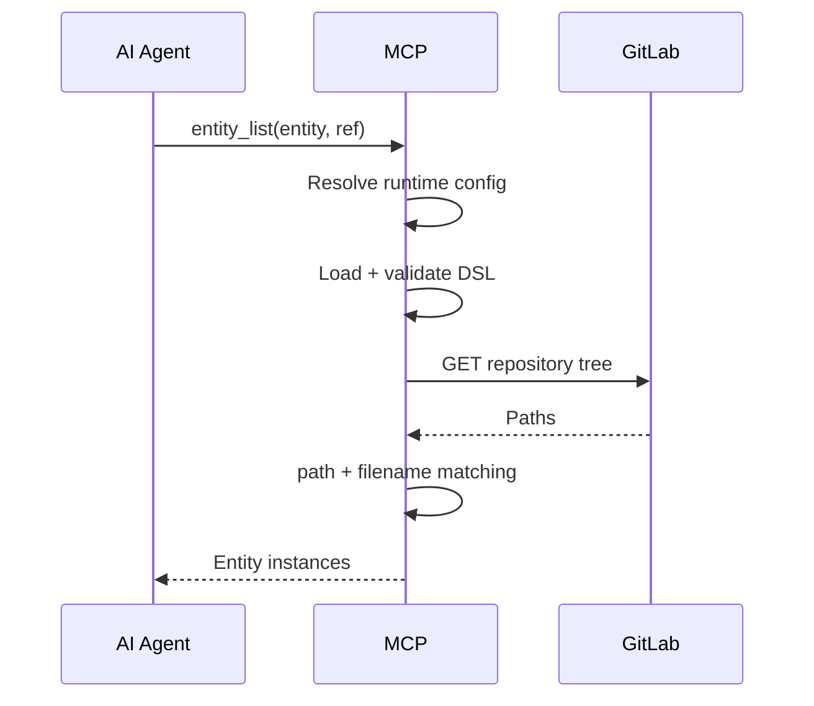
```mermaid
sequenceDiagram
    participant A as AI Agent
    participant M as MCP
    participant G as GitLab

    A->>M: entity_list(entity, ref)
    M->>M: Resolve runtime config
    M->>M: Load + validate DSL
    M->>G: GET repository tree
    G-->>M: Paths
    M->>M: path + filename matching
    M-->>A: Entity instances
```

---

## 5.2. Чтение файла

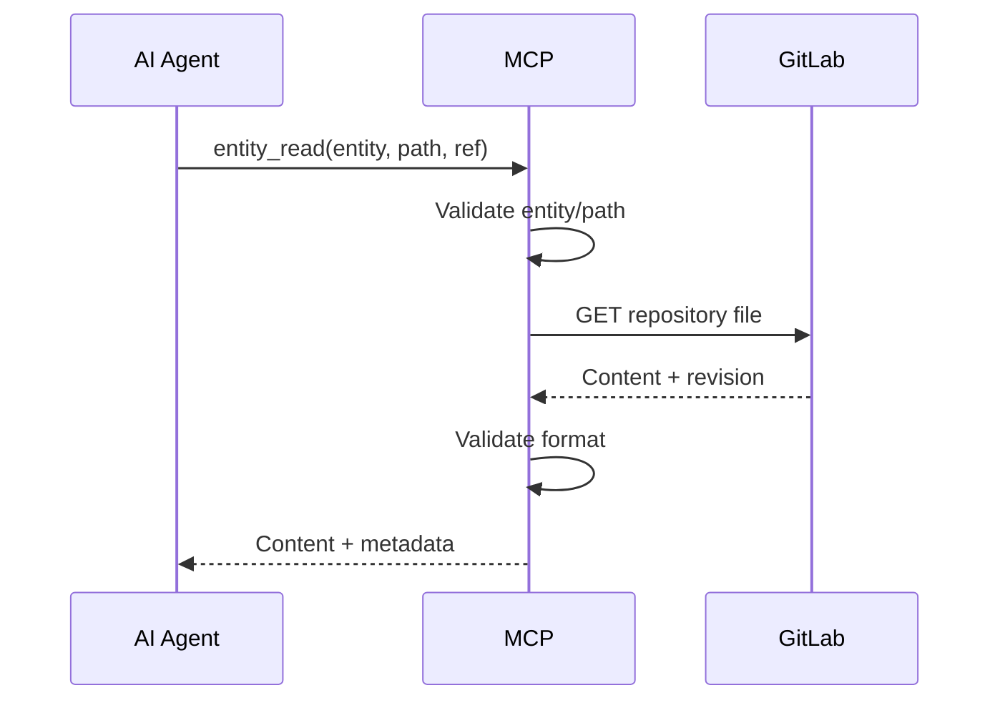
```mermaid
sequenceDiagram
    participant A as AI Agent
    participant M as MCP
    participant G as GitLab

    A->>M: entity_read(entity, path, ref)
    M->>M: Validate entity/path
    M->>G: GET repository file
    G-->>M: Content + revision
    M->>M: Validate format
    M-->>A: Content + metadata
```

---

## 5.3. Получение истории и diff

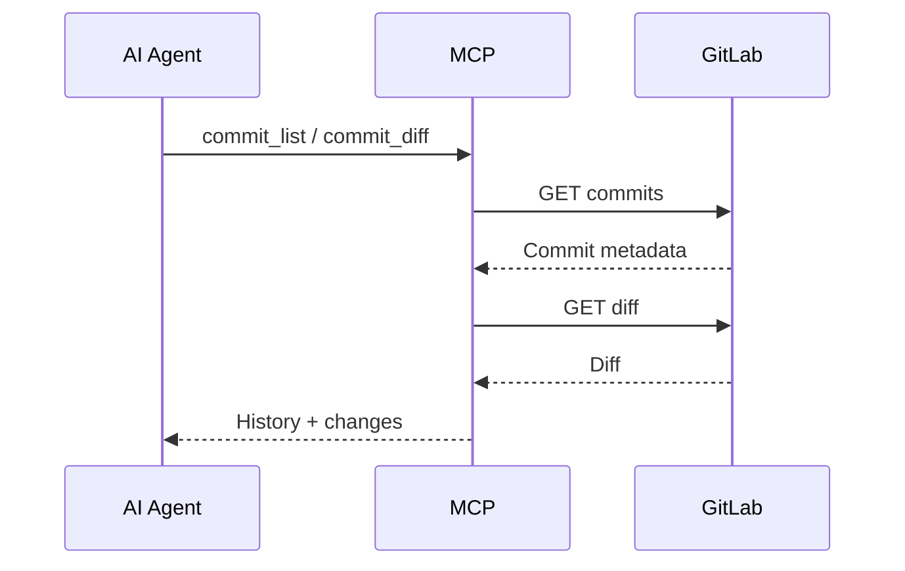
```mermaid
sequenceDiagram
    participant A as AI Agent
    participant M as MCP
    participant G as GitLab

    A->>M: commit_list / commit_diff
    M->>G: GET commits
    G-->>M: Commit metadata
    M->>G: GET diff
    G-->>M: Diff
    M-->>A: History + changes
```

---

## 5.4. Список веток

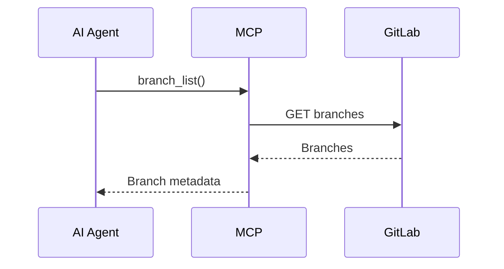
```mermaid
sequenceDiagram
    participant A as AI Agent
    participant M as MCP
    participant G as GitLab

    A->>M: branch_list()
    M->>G: GET branches
    G-->>M: Branches
    M-->>A: Branch metadata
```

---

## 5.5. Создание ветки

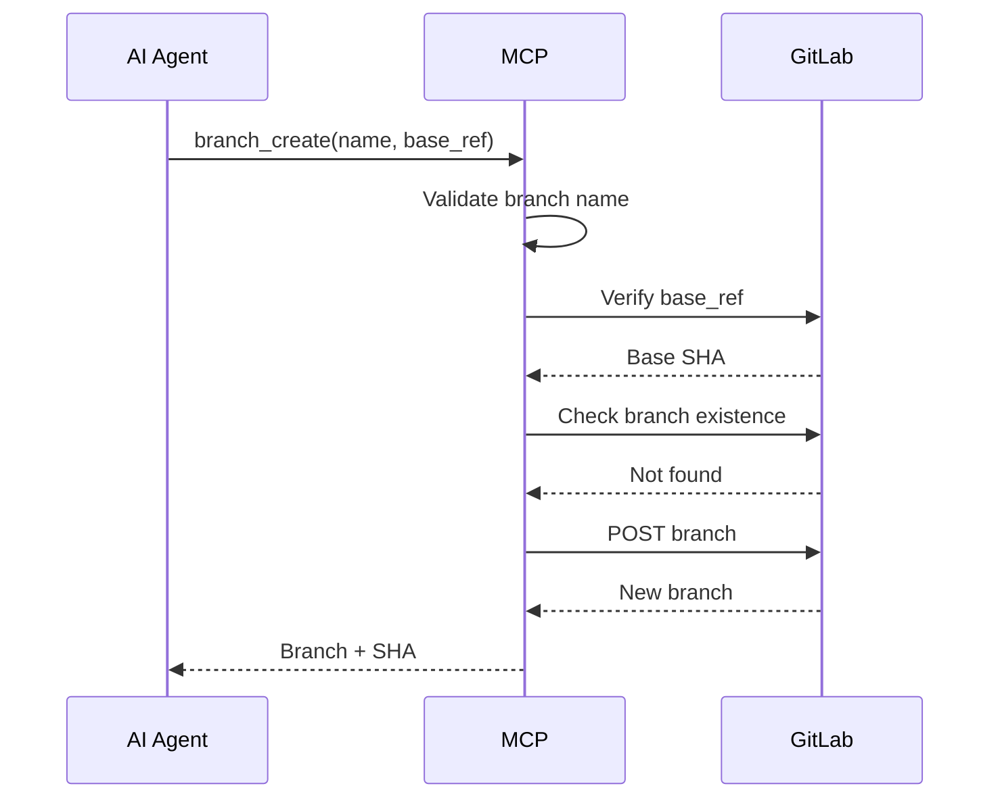
```mermaid
sequenceDiagram
    participant A as AI Agent
    participant M as MCP
    participant G as GitLab

    A->>M: branch_create(name, base_ref)
    M->>M: Validate branch name
    M->>G: Verify base_ref
    G-->>M: Base SHA
    M->>G: Check branch existence
    G-->>M: Not found
    M->>G: POST branch
    G-->>M: New branch
    M-->>A: Branch + SHA
```

`Validate branch name` выполняет правила раздела 3.15 до обращения к GitLab.

---

## 5.6. Создание файла

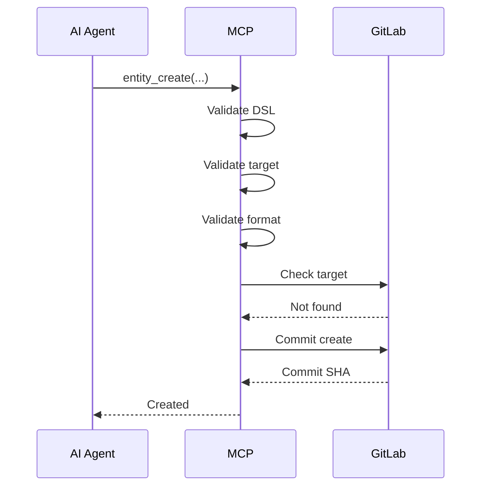
```mermaid
sequenceDiagram
    participant A as AI Agent
    participant M as MCP
    participant G as GitLab

    A->>M: entity_create(...)
    M->>M: Validate DSL
    M->>M: Validate target
    M->>M: Validate format
    M->>G: Check target
    G-->>M: Not found
    M->>G: Commit create
    G-->>M: Commit SHA
    M-->>A: Created
```

---

## 5.7. Изменение файла

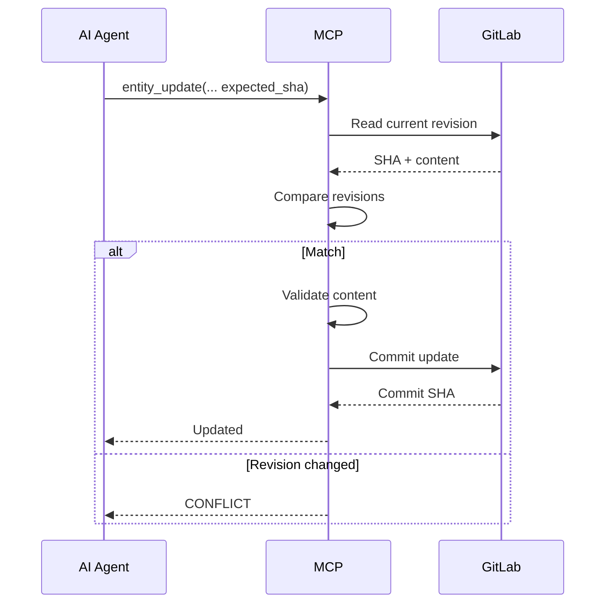
```mermaid
sequenceDiagram
    participant A as AI Agent
    participant M as MCP
    participant G as GitLab

    A->>M: entity_update(... expected_sha)
    M->>G: Read current revision
    G-->>M: SHA + content
    M->>M: Compare revisions

    alt Match
        M->>M: Validate content
        M->>G: Commit update
        G-->>M: Commit SHA
        M-->>A: Updated
    else Revision changed
        M-->>A: CONFLICT
    end
```

---

## 5.8. Удаление

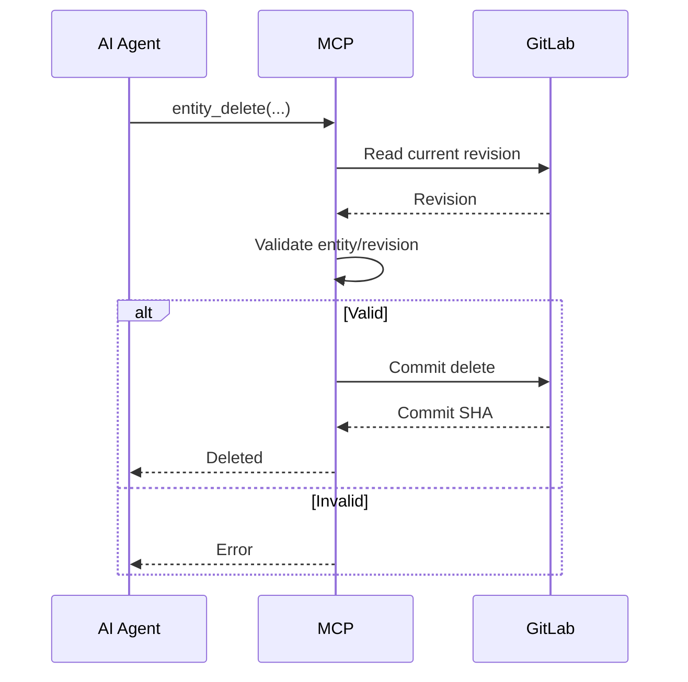
```mermaid
sequenceDiagram
    participant A as AI Agent
    participant M as MCP
    participant G as GitLab

    A->>M: entity_delete(...)
    M->>G: Read current revision
    G-->>M: Revision
    M->>M: Validate entity/revision

    alt Valid
        M->>G: Commit delete
        G-->>M: Commit SHA
        M-->>A: Deleted
    else Invalid
        M-->>A: Error
    end
```

---

## 5.9. Перемещение

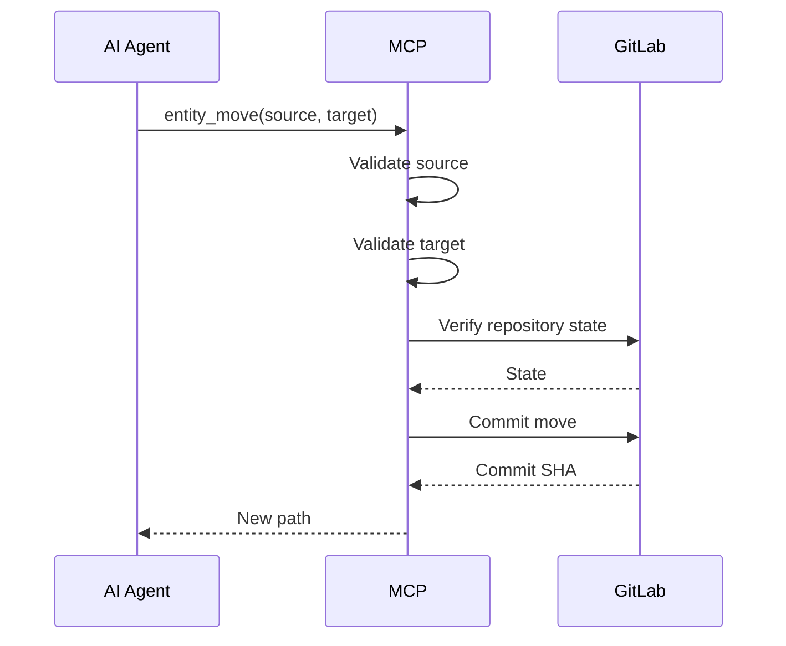
```mermaid
sequenceDiagram
    participant A as AI Agent
    participant M as MCP
    participant G as GitLab

    A->>M: entity_move(source, target)
    M->>M: Validate source
    M->>M: Validate target
    M->>G: Verify repository state
    G-->>M: State
    M->>G: Commit move
    G-->>M: Commit SHA
    M-->>A: New path
```

---

## 5.10. Batch commit

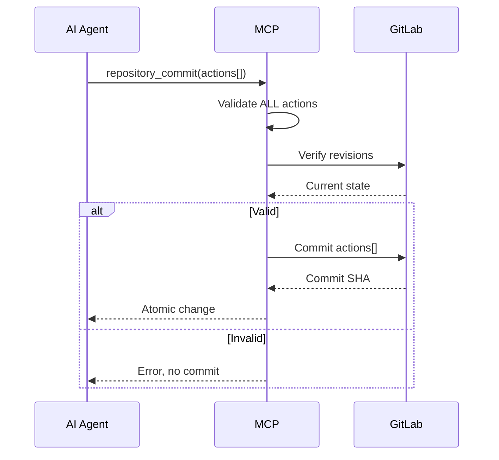
```mermaid
sequenceDiagram
    participant A as AI Agent
    participant M as MCP
    participant G as GitLab

    A->>M: repository_commit(actions[])
    M->>M: Validate ALL actions
    M->>G: Verify revisions
    G-->>M: Current state

    alt Valid
        M->>G: Commit actions[]
        G-->>M: Commit SHA
        M-->>A: Atomic change
    else Invalid
        M-->>A: Error, no commit
    end
```

---

## 5.11. Сравнение refs

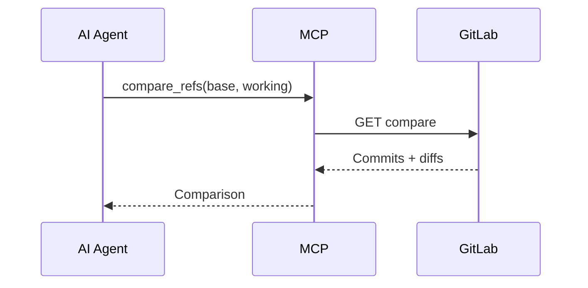
```mermaid
sequenceDiagram
    participant A as AI Agent
    participant M as MCP
    participant G as GitLab

    A->>M: compare_refs(base, working)
    M->>G: GET compare
    G-->>M: Commits + diffs
    M-->>A: Comparison
```

---

## 5.12. Создание Merge Request

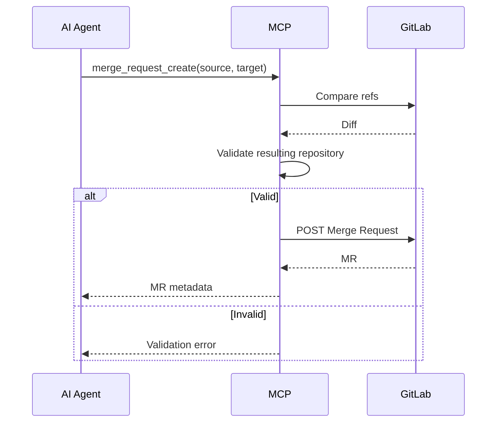
```mermaid
sequenceDiagram
    participant A as AI Agent
    participant M as MCP
    participant G as GitLab

    A->>M: merge_request_create(source, target)
    M->>G: Compare refs
    G-->>M: Diff
    M->>M: Validate resulting repository

    alt Valid
        M->>G: POST Merge Request
        G-->>M: MR
        M-->>A: MR metadata
    else Invalid
        M-->>A: Validation error
    end
```

---

## 5.13. Получение Merge Request

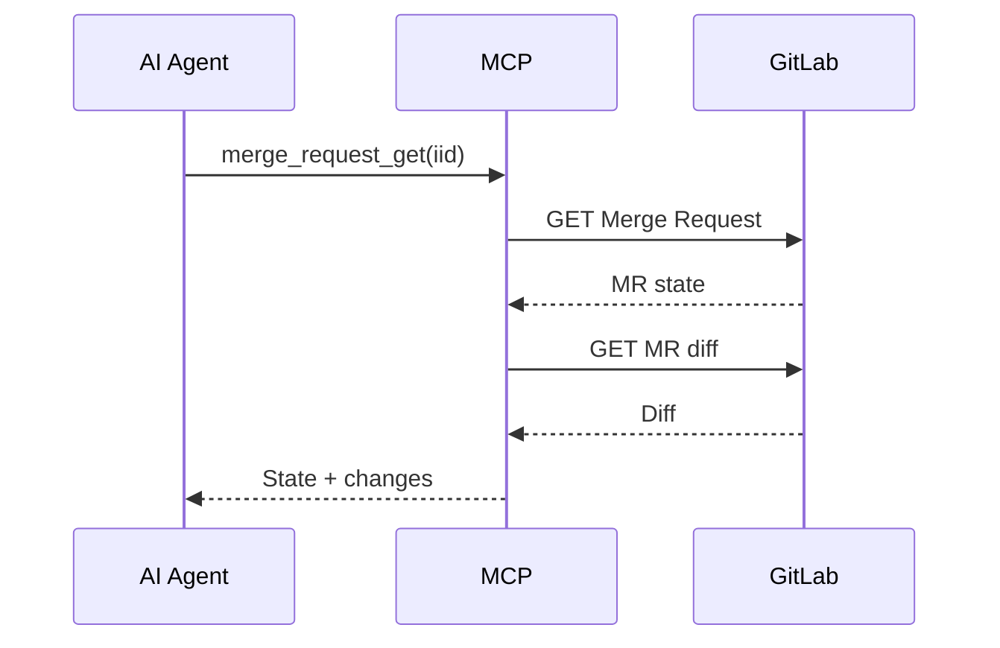
```mermaid
sequenceDiagram
    participant A as AI Agent
    participant M as MCP
    participant G as GitLab

    A->>M: merge_request_get(iid)
    M->>G: GET Merge Request
    G-->>M: MR state
    M->>G: GET MR diff
    G-->>M: Diff
    M-->>A: State + changes
```

---

## 5.14. Merge

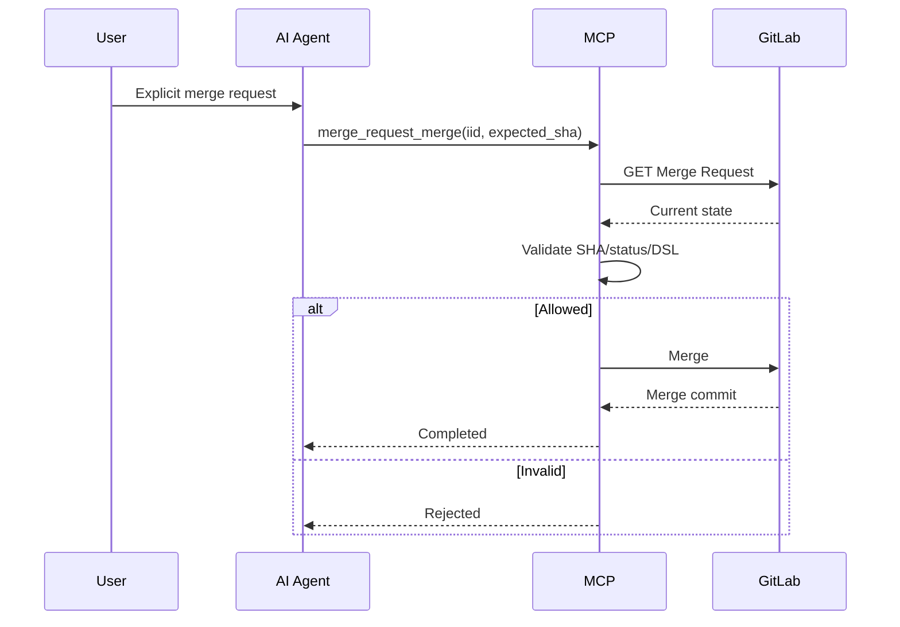
```mermaid
sequenceDiagram
    participant U as User
    participant A as AI Agent
    participant M as MCP
    participant G as GitLab

    U->>A: Explicit merge request
    A->>M: merge_request_merge(iid, expected_sha)
    M->>G: GET Merge Request
    G-->>M: Current state
    M->>M: Validate SHA/status/DSL

    alt Allowed
        M->>G: Merge
        G-->>M: Merge commit
        M-->>A: Completed
    else Invalid
        M-->>A: Rejected
    end
```

---

## 5.15. Удаление ветки

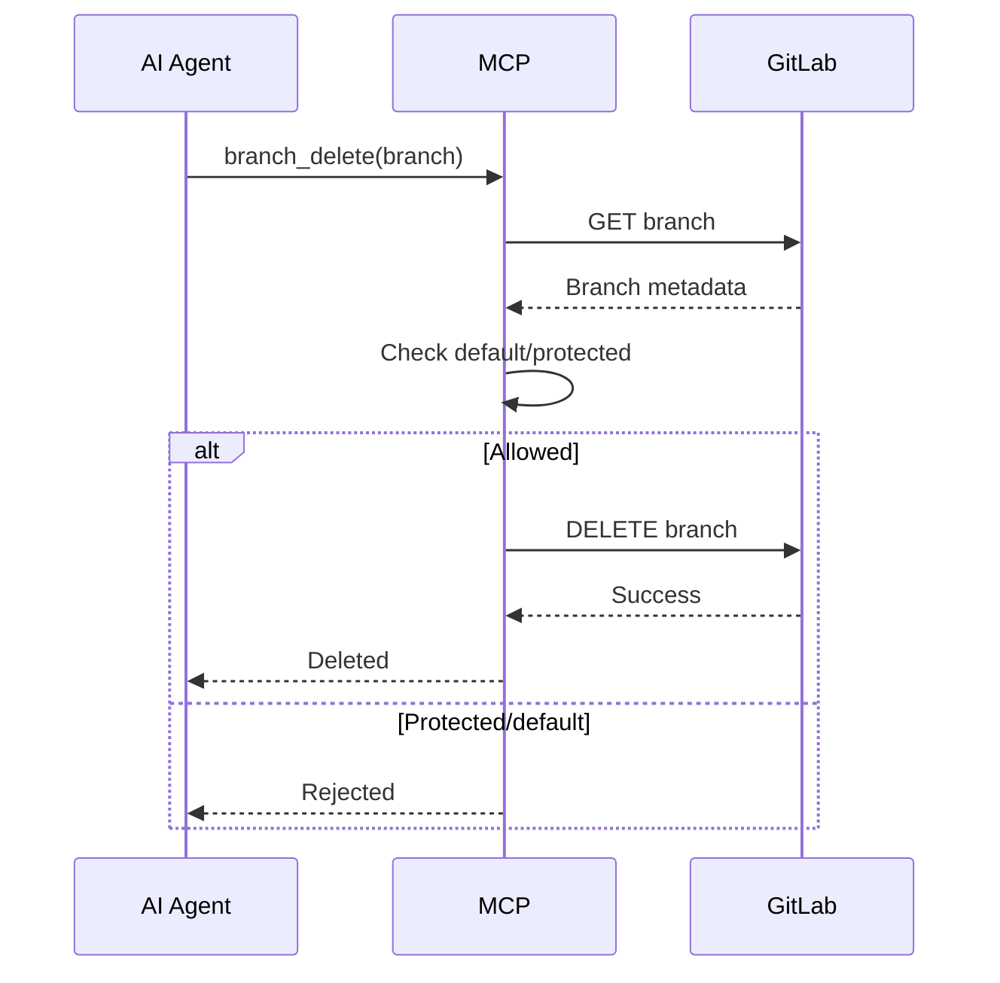
```mermaid
sequenceDiagram
    participant A as AI Agent
    participant M as MCP
    participant G as GitLab

    A->>M: branch_delete(branch)
    M->>G: GET branch
    G-->>M: Branch metadata
    M->>M: Check default/protected

    alt Allowed
        M->>G: DELETE branch
        G-->>M: Success
        M-->>A: Deleted
    else Protected/default
        M-->>A: Rejected
    end
```

---

# 6. Логика и принципы работы с DSL

## 6.1. DSL — декларация репозитория

DSL отвечает:

```text
что существует
где находится
как определить файл
какого он формата
из какого template создаётся
с какими сущностями связан
```

DSL не определяет внутреннюю бизнес-структуру документа.

---

## 6.2. Закрытая Grammar

```yaml
declaration:
  kind: architecture_repository
  version: v2

entities:
  ...
```

Неизвестный structural key является ошибкой.

---

## 6.3. Presets

Preset-значения берутся только из:

```text
dsl/DSL_V2_TABLES.yaml
```

Добавлять новый preset непосредственно в код запрещено.

---

## 6.4. Произвольные значения

Произвольными являются:

```text
entity.name
files.path.value
files.filename.value
files.template
```

`relations[]` содержат пользовательские идентификаторы, но обязаны разрешаться в существующий `entity.name`.

---

## 6.5. Имена сущностей

Допустимы произвольные уникальные логические имена:

```text
fact
requirement
network_security_requirement
logical_component
```

Добавление новой сущности не требует расширения preset registry.

---

## 6.6. Relations

```yaml
- name: fact
  relations:
    - requirement
    - category
```

материализует:

```text
fact ↔ requirement
fact ↔ category
```

Но не создаёт автоматических отношений между конкретными экземплярами.

---

## 6.7. File matching

Каждая сущность определяет файл двумя независимыми характеристиками:

```yaml
files:
  path:
    match: ...
    value: ...

  filename:
    match: ...
    value: ...
```

### `path`

`path` означает **только путь к каталогу, в котором расположен файл**, относительно корня Git repository.

В `path` **не входит имя самого файла**.

Например, для полного repository path:

```text
systems/payment/facts/F-0042.md
```

MCP должен разделить его на:

```text
path:
systems/payment/facts

filename:
F-0042.md
```

Для:

```text
requirements/security/R-0017.yaml
```

получаем:

```text
path:
requirements/security

filename:
R-0017.yaml
```

Для файла непосредственно в корне repository:

```text
README.md
```

нормализованное значение:

```text
path = ""
filename = "README.md"
```

`path` всегда:

* repository-relative;
* без имени файла;
* использует POSIX separator `/`;
* не начинается с `/`;
* после нормализации не заканчивается `/`;
* для repository root представлен пустой строкой.

Пример правила:

```yaml
path:
  match: exact
  value: "facts"
```

соответствует:

```text
facts/F-0001.md
facts/F-0002.md
```

но не соответствует:

```text
systems/payment/facts/F-0001.md
```

Regex:

```yaml
path:
  match: regex
  value: "^systems/[^/]+/facts$"
```

может соответствовать:

```text
systems/payment/facts
systems/crm/facts
systems/iam/facts
```

---

### `filename`

`filename` означает **только basename файла**, без пути к каталогу.

Например:

```text
systems/payment/facts/F-0042.md
```

даёт:

```text
filename = F-0042.md
```

Правило:

```yaml
filename:
  match: regex
  value: "^F-[0-9]{4}\\.md$"
```

проверяется только против:

```text
F-0042.md
```

и никогда не против:

```text
systems/payment/facts/F-0042.md
```

---

### Итоговое правило принадлежности

Файл принадлежит сущности только если одновременно:

```text
path rule matches directory path
AND
filename rule matches basename
```

Пример:

```yaml
files:
  path:
    match: regex
    value: "^systems/[^/]+/facts$"

  filename:
    match: regex
    value: "^F-[0-9]{4}\\.md$"
```

Файл:

```text
systems/payment/facts/F-0042.md
```

разбирается:

```text
path     = systems/payment/facts
filename = F-0042.md
```

Проверка:

```text
path regex     → MATCH
filename regex → MATCH
                  ↓
           entity instance
```

Файл:

```text
systems/payment/docs/F-0042.md
```

даёт:

```text
path regex     → NO MATCH
filename regex → MATCH
                  ↓
             NOT ENTITY
```

Файл:

```text
systems/payment/facts/readme.md
```

даёт:

```text
path regex     → MATCH
filename regex → NO MATCH
                  ↓
             NOT ENTITY
```

`match=exact` всегда означает полное совпадение нормализованного значения.

`match=regex` также применяется ко всему значению, то есть семантически соответствует `fullmatch`, а не поиску substring.

Regex компилируется один раз при построении runtime model.

---

## 6.8. Неоднозначность запрещена

Если один файл соответствует двум сущностям:

```text
Entity A ─┐
          ├── file
Entity B ─┘
```

repository state считается невалидным.

MCP не выбирает сущность самостоятельно.

---

## 6.9. Format

`format` определяет только синтаксический parser/validator.

Например:

```text
yaml
json
markdown
markdown_front_matter
text
```

MCP Core не валидирует бизнес-смысл содержимого.

---

## 6.10. Template

Template:

```text
обычный файл
того же format
расположен в repository
используется для создания экземпляра
```

Template не является schema.

После создания экземпляр может свободно редактироваться.

---

## 6.11. Runtime Index

Рекомендуемая модель:

```text
RepositoryModel

entities_by_name
relations_graph
compiled_path_matchers
compiled_filename_matchers
instances_by_entity
entity_by_repository_path
```

---

## 6.12. Работа ИИ-агента

Штатный путь:

```text
User intent
    ↓
AI reasoning
    ↓
MCP operation
    ↓
DSL validation
    ↓
GitLab
```

ИИ не должен обходить DSL прямыми операциями GitLab, если соответствующая MCP-операция существует.

DSL является governance layer между агентом и архитектурным репозиторием.

---

# 7. Дорожная карта

[ ] Создать базовую структуру Python-проекта и `.venv`.

[ ] Реализовать загрузку `.env`.

[ ] Реализовать runtime configuration interface для ИИ-агента.

[ ] Реализовать приоритет `AI runtime > .env > defaults`.

[ ] Реализовать `configuration_schema()` без раскрытия секретных значений.

[ ] Создать `dsl/DSL_V2_TABLES.yaml`.

[ ] Зафиксировать Grammar, Presets и Contracts DSL v2.

[ ] Добавить генерируемый `docs/dsl/DSL_V2_TABLES.md`.

[ ] Создать `examples/declarations/`.

[ ] Создать `examples/templates/`.

[ ] Создать positive и negative примеры деклараций.

[ ] Реализовать DSL parser.

[ ] Реализовать closed-grammar validation.

[ ] Реализовать preset validation.

[ ] Реализовать validation произвольных `entity.name`.

[ ] Реализовать уникальность сущностей.

[ ] Реализовать `relations[] → entity.name`.

[ ] Реализовать runtime relations graph.

[ ] Реализовать нормализацию repository path.

[ ] Реализовать разбиение полного пути на `path` и `filename`.

[ ] Реализовать `path.match=exact`.

[ ] Реализовать `path.match=regex`.

[ ] Реализовать `filename.match=exact`.

[ ] Реализовать `filename.match=regex`.

[ ] Реализовать overlap detection.

[ ] Реализовать GitLab API client.

[ ] Реализовать TLS verification с `false` по умолчанию.

[ ] Реализовать SHA-256 certificate pinning.

[ ] Реализовать локальный certificate pin trust store.

[ ] Реализовать `tls_certificate_info()`.

[ ] Реализовать отказ соединения при `TLS_PIN_MISMATCH`.

[ ] Реализовать безопасную работу с credentials.

[ ] Реализовать Repository Tree pagination.

[ ] Реализовать Runtime Repository Model.

[ ] Реализовать `entity_list`.

[ ] Реализовать `entity_read`.

[ ] Реализовать `entity_relations`.

[ ] Реализовать `entity_template`.

[ ] Реализовать format validators.

[ ] Реализовать `branch_list`.

[ ] Реализовать строгий `validate_branch_name`.

[ ] Реализовать проверку серверных GitLab Push Rules.

[ ] Реализовать `branch_create`.

[ ] Реализовать `branch_delete`.

[ ] Реализовать `entity_create`.

[ ] Реализовать optimistic concurrency.

[ ] Реализовать `entity_update`.

[ ] Реализовать `entity_delete`.

[ ] Реализовать `entity_move`.

[ ] Реализовать batch `repository_commit`.

[ ] Реализовать `commit_list`.

[ ] Реализовать `commit_get`.

[ ] Реализовать `commit_diff`.

[ ] Реализовать `compare_refs`.

[ ] Реализовать `merge_request_create`.

[ ] Реализовать `merge_request_get`.

[ ] Реализовать `merge_request_diff`.

[ ] Реализовать `merge_request_merge` только после явного запроса.

[ ] Реализовать cache DSL по commit SHA.

[ ] Реализовать cache repository tree по commit SHA.

[ ] Реализовать automatic cache invalidation.

[ ] Реализовать path traversal protection.

[ ] Реализовать защиту default/protected branch.

[ ] Реализовать нормализованную модель ошибок MCP.

[ ] Добавить unit tests всех DSL-контрактов.

[ ] Добавить exhaustive tests preset-значений.

[ ] Добавить tests `path` / `filename` decomposition.

[ ] Добавить tests file matcher overlap.

[ ] Добавить tests branch name validation.

[ ] Добавить tests runtime configuration precedence.

[ ] Добавить TLS pinning positive/negative tests.

[ ] Добавить integration tests GitLab read operations.

[ ] Добавить integration tests branch → commit → MR.

[ ] Добавить integration tests конфликтующих изменений.

[ ] Добавить integration tests atomic multi-file commit.

[ ] Добавить security tests path traversal.

[ ] Добавить security tests credential leakage.

[ ] Добавить performance tests больших repository tree.

[ ] Добавить README.

[ ] Добавить AGENTS.md.

[ ] Провести полный автоматизированный аудит DSL v2.

[ ] Проверить отсутствие undocumented Grammar/Presets в коде.

[ ] Зафиксировать DSL v2 после прохождения полного набора positive/negative тестов.
